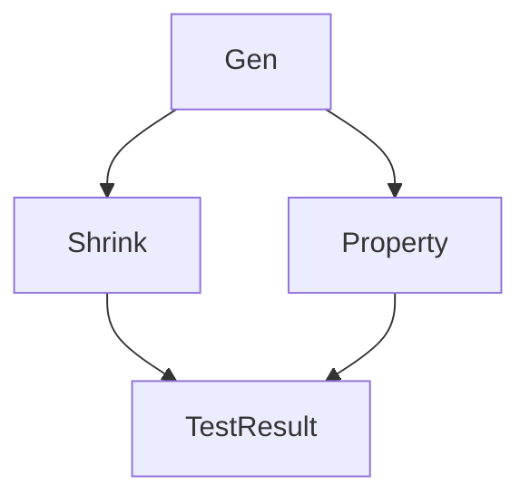

# docs/ - Documentation Development Guide

This directory contains all InvariantSwift documentation. When working on documentation, follow these standards.

**Parent Context**: This extends [../CLAUDE.md](../CLAUDE.md) - Universal project rules apply.

---

## Documentation Structure

```
docs/
├── proposals/           # ISP-0001 through ISP-0010 (InvariantSwift Proposals)
├── architecture/        # Architecture diagrams and design docs
├── examples/            # Code examples and usage patterns
├── COOKBOOK.md          # Usage patterns and recipes (CRITICAL)
├── MACROS.md            # Macro documentation (CRITICAL)
├── ONBOARDING.md        # New contributor guide
├── API_REFERENCE_GENERATED.md  # Auto-generated API reference
├── API_DOCUMENTATION_TEMPLATE.md  # Documentation template
└── ADVANCED.md          # Advanced features documentation
```

---

## Documentation Standards

### Public API Documentation (REQUIRED)

All public APIs must have doc comments following SwiftDoc conventions:

```swift
/// Brief one-line summary.
///
/// Detailed description explaining purpose, behavior, and usage.
/// Include examples for complex functionality.
///
/// # Example
/// ```swift
/// let gen = Gen.int(in: 1...100)
/// let sample = gen.sample(size: 50)
/// ```
///
/// - Parameters:
///   - size: The size parameter controlling generation depth
///   - rng: Random number generator (default: system RNG)
/// - Returns: A generated value of type `T`
/// - Throws: `GeneratorError` if generation fails
/// - Complexity: O(1) for primitive types, O(n) for collections
/// - Note: This generator is deterministic given the same seed
/// - Warning: Large sizes may cause stack overflow for recursive types
/// - SeeAlso: `Gen.array`, `Gen.optional`
public func example<T>(size: Size, rng: inout RNG) throws -> T {
  // ...
}
```

### Documentation Sections (In Order)

1. **Brief Summary** (1 line, no period)
2. **Detailed Description** (1-3 paragraphs)
3. **Example Code** (when helpful, use triple-backtick swift code blocks)
4. **Parameters** (describe each parameter)
5. **Returns** (describe return value and conditions)
6. **Throws** (list possible errors)
7. **Complexity** (time/space complexity for algorithms)
8. **Note** (additional information)
9. **Warning** (important caveats)
10. **SeeAlso** (related types/functions)

### Documentation Checker

Run documentation coverage check:
```bash
python3 check_docs.py --verbose

# Or use slash command
/check-docs --verbose
```

**Coverage Target**: 100% for public APIs (enforced as warning in PRs)

---

## COOKBOOK.md Updates

When adding new features, **update COOKBOOK.md** with usage patterns.

### COOKBOOK.md Structure

```markdown
# InvariantSwift Cookbook

## Generator Patterns
### Basic Generators
- Primitive types
- Collections
- Optional and Result types

### Composite Generators
- flatMap patterns
- Recursive structures
- Custom generators

### Domain-Specific Generators
- UUID, URL, Date generators
- Network protocols
- File paths

## Property Testing Patterns
### Basic Properties
### Stateful Testing
### Differential Testing

## Advanced Patterns
### Custom Shrinking
### Performance Optimization
### Integration with Swift Testing
```

### Adding COOKBOOK Entry

1. **Identify Category**: Where does this feature fit?
2. **Write Self-Contained Example**:
   ```markdown
   ### Custom UUID Generator
   
   Generate valid UUIDs for testing:
   
   ```swift
   import InvariantSwift
   
   let uuidGen = Gen.uuid
   checkProperty("UUIDs are valid") {
     let uuid = uuidGen.sample()
     #expect(uuid.uuidString.count == 36)
   }
   ```
   
   **Use Case**: Testing APIs that consume UUIDs
   **See Also**: `Gen.url`, `Gen.date`
   ```

3. **Link from API Docs**: Add `- SeeAlso: COOKBOOK.md#custom-uuid-generator` to API doc comments

---

## ISP Proposals

### Creating New ISP

Use `/create-isp "Title"` command or follow ISP template:

```markdown
# ISP-XXXX: Title

## Metadata
- **Status**: Draft | Accepted | Implemented | Rejected
- **Author**: Name <email>
- **Created**: YYYY-MM-DD
- **Updated**: YYYY-MM-DD

## Summary
One-paragraph summary of the proposal.

## Motivation
What problem does this solve? Why is it needed?

## Proposed Solution
High-level design and approach.

## Detailed Design
API design, implementation details, examples.

## Impact
- **Breaking Changes**: Yes/No + details
- **API Additions**: List new public APIs
- **Dependencies**: Any new dependencies
- **Performance**: Expected impact

## Alternatives Considered
Other approaches and why they were rejected.

## References
- Related ISPs
- External papers/libraries
- Swift Evolution proposals
```

### ISP Lifecycle

1. **Draft**: Initial proposal, open for discussion
2. **Accepted**: Approved for implementation
3. **Implemented**: Merged into main branch
4. **Rejected**: Not pursuing (with rationale)

### Existing ISPs

| ISP | Title | Status |
|-----|-------|--------|
| ISP-0001 | Scheduler Race Condition Testing | Implemented |
| ISP-0002 | Composite Generators | Implemented |
| ISP-0003 | Rule-Based Stateful Testing | Implemented |
| ISP-0004 | Example Database Reproduce | Implemented |
| ISP-0005 | Differential Testing | Implemented |
| ISP-0006 | Contract Testing | Implemented |
| ISP-0007 | libFuzzer Integration | Draft |
| ISP-0008 | Targeted Property Testing | Draft |
| ISP-0009 | Ghostwriter | Implemented |
| ISP-0010 | Faker Integration | Implemented |

---

## API Reference Generation

### Auto-Generated Reference

The file `API_REFERENCE_GENERATED.md` is **auto-generated**. Do not edit manually.

Generate with:
```bash
python3 Scripts/generate_api_reference.py
# Or use make target
make doc-api
```

### Manual API Documentation

For complex APIs, create dedicated markdown files in `docs/`:
- `GENERATORS.md` - Generator reference
- `MACROS.md` - Macro reference
- `ADVANCED.md` - Advanced features

---

## Architecture Documentation

### Diagrams

Generate architecture diagrams:
```bash
python3 Scripts/generate_architecture_diagrams.py
# Or use make target
make doc-diagrams
```

Diagrams are generated from code structure into `docs/architecture/`.

### Mermaid Diagrams

Use Mermaid for inline diagrams in markdown:

```markdown

```

---

## Documentation Testing

### Validate Examples

Ensure code examples in documentation compile:
```bash
python3 Scripts/validate_doc_examples.py --verbose
# Or use make target
make doc-examples
```

### Full Documentation Check

Run all documentation validation:
```bash
make docs-validate
```

This runs:
1. Documentation coverage check (`check_docs.py`)
2. Example validation (`validate_doc_examples.py`)
3. Diagram generation (`generate_architecture_diagrams.py`)
4. API reference generation (`generate_api_reference.py`)

---

## Documentation Workflow

### Adding New Public API

1. **Write API with doc comments** (following standards above)
2. **Add usage example to COOKBOOK.md**
3. **Run documentation check**:
   ```bash
   /check-docs --verbose
   ```
4. **Verify example compiles** (if code example included):
   ```bash
   make doc-examples
   ```
5. **Commit documentation with code**

### Updating Existing Documentation

1. **Check current documentation coverage**:
   ```bash
   /check-docs --json
   ```
2. **Identify gaps** (undocumented parameters, missing examples)
3. **Update doc comments and COOKBOOK.md**
4. **Regenerate API reference**:
   ```bash
   make doc-api
   ```
5. **Commit updated docs**

---

## Quick Find Commands

### Find Documentation

```bash
# Find ISP proposals
ls docs/proposals/ISP-*.md

# Find undocumented public APIs
python3 check_docs.py --json | jq '.undocumented[]'

# Find COOKBOOK entries
rg "^###" docs/COOKBOOK.md

# Find code examples in docs
rg -A 10 "```swift" docs/

# Find architecture diagrams
find docs/architecture -name "*.mermaid" -o -name "*.svg"
```

### Find API Documentation

```bash
# Find doc comment for a type
rg -A 20 "^/// " Sources/ | rg -B 5 "public struct TypeName"

# Find all SeeAlso references
rg "- SeeAlso:" Sources/

# Find missing doc comments
rg "^public (func|struct|class|enum)" Sources/ \
  | rg -v "///"  # Public APIs without doc comments
```

---

## Common Documentation Tasks

### Task 1: Document New Generator

1. Add doc comment to generator in `Sources/InvariantSwift/Generators/`
2. Add usage example to `docs/COOKBOOK.md` under "Generator Patterns"
3. Link from doc comment: `- SeeAlso: COOKBOOK.md#generator-name`
4. Run `/check-docs`

### Task 2: Create ISP Proposal

1. Run `/create-isp "Proposal Title"`
2. Fill in all sections (use existing ISPs as reference)
3. Create GitHub issue linking to ISP
4. Discuss with maintainers
5. Update status based on decision

### Task 3: Update API Reference

1. Make API changes with proper doc comments
2. Run `make doc-api` to regenerate reference
3. Review `docs/API_REFERENCE_GENERATED.md`
4. Commit both code and generated docs

---

## Documentation Style Guide

### Language

- **Use active voice**: "Generates an integer" not "An integer is generated"
- **Be concise**: One sentence per concept
- **Use examples**: Show, don't just tell
- **Avoid jargon**: Explain property-based testing terms

### Code Examples

- **Self-contained**: Include all imports
- **Compilable**: Test examples before documenting
- **Minimal**: Focus on the feature, remove noise
- **Commented**: Explain non-obvious parts

### Formatting

- **Headers**: Use ATX-style (`#`, `##`, `###`)
- **Code blocks**: Always specify language (```swift)
- **Lists**: Use `-` for unordered, `1.` for ordered
- **Tables**: Use for structured data
- **Mermaid**: Use for diagrams
- **Bold/Italic**: **Bold** for emphasis, *italic* for terms

---

## Pre-PR Documentation Checklist

Before creating a PR with documentation changes:

1. ✅ All public APIs have doc comments
2. ✅ COOKBOOK.md updated for new features
3. ✅ Code examples tested/compilable
4. ✅ `/check-docs` passes (or explains why not)
5. ✅ ISP proposals updated (if applicable)
6. ✅ API reference regenerated (if API changes)
7. ✅ No hardcoded values (use constants/enums)
8. ✅ Links work (no 404s)

**Quick Validation**:
```bash
/check-docs --verbose && make doc-examples
```

---

## Related Files

| File | Purpose |
|------|---------|
| `check_docs.py` | Documentation coverage checker |
| `Scripts/generate_api_reference.py` | API reference generator |
| `Scripts/generate_architecture_diagrams.py` | Diagram generator |
| `Scripts/validate_doc_examples.py` | Example validator |
| `API_DOCUMENTATION_TEMPLATE.md` | Doc comment template |

---

## Notes

- Documentation is code: version control, review, test
- Good docs reduce support burden
- Examples are worth 1000 words
- Keep docs close to code (in-source doc comments preferred)
- Auto-generate when possible (API reference, diagrams)
- Manual docs for concepts, tutorials, guides (COOKBOOK.md)
