# InvariantSwift Architecture Document

> **Status**: Approved
> **Last Updated**: January 16, 2026
> **Authors**: Bruno, InvariantSwift Team
> **Reviewers**: Technical Architecture Board

---

## 1. Overview

### 1.1 Purpose

InvariantSwift is a comprehensive property-based testing framework for Swift 6, designed to help developers write more reliable and thorough tests by automatically generating test cases and finding edge cases. The framework combines mathematical rigor from category theory with practical property-based testing methodologies, enabling systematic verification of software correctness across diverse input domains.

### 1.2 Scope

This document covers:
- **In Scope**: Core architecture, component design, data flow, API design, testing strategy, deployment, and security model
- **Out of Scope**: Specific implementation details, performance tuning micro-optimizations, CI/CD pipeline specifics beyond deployment strategy

### 1.3 Audience

- **Primary**: Software architects, senior developers, framework maintainers
- **Secondary**: Contributors, API users, QA engineers, DevOps teams

### 1.4 Document Conventions

- `Code` - Technical terms, file names, commands, types
- **Bold** - Important concepts, emphasis
- *Italic* - Emphasis, technical references
- > Blockquotes - Important notes or warnings
- `---` - Section separators for document sharding

---

## 2. Goals and Non-Goals

### 2.1 Goals

1. **Comprehensive Test Generation** - Automatically generate diverse test cases across primitive, collection, and custom types
2. **Mathematical Rigor** - Verify functional programming laws (Functor, Applicative, Monad) through property testing
3. **Coverage-Guided Testing** - Achieve 99%+ code coverage through intelligent input generation biased toward uncovered code paths
4. **Swift 6 Compliance** - Full support for Swift 6 strict concurrency with actor isolation and Sendable constraints
5. **Zero-Cost Abstractions** - Maintain high performance (10,000+ generations/second) with minimal memory footprint
6. **Developer Ergonomics** - Provide intuitive APIs and macros (`@PropertyTest`, `@BusinessRule`) that hide mathematical complexity
7. **Advanced Testing Capabilities** - Support model-based testing, lens systems, linearizability testing, and SMT solver constraints
8. **Seamless Integration** - Integrate with Swift Testing framework and SPM plugin system

### 2.2 Non-Goals

1. Deterministic fuzzing (focus on property testing, not mutation testing)
2. Distributed testing across multiple machines
3. Network-based test coordination
4. GUI-based test result visualization
5. Runtime instrumentation or bytecode modification

### 2.3 Success Metrics

| Metric | Target | Current | Notes |
|--------|--------|---------|-------|
| Code Coverage | 99% | 95%+ | Dog food tests verify framework itself |
| Generation Throughput | 10,000+ gen/sec | On-track | Measured with primitive types |
| Memory Footprint | <10MB per 1000 iterations | On-track | Lazy evaluation strategy |
| Shrinking Efficiency | <5% overhead vs generation | On-track | Tree-based shrinking algorithm |
| API Usability | <5min to write property test | On-track | Macro support reduces boilerplate |
| Swift 6 Compliance | 100% strict concurrency | 100% | Enforced via compiler warnings |

---

## 3. System Context

### 3.1 System Boundaries

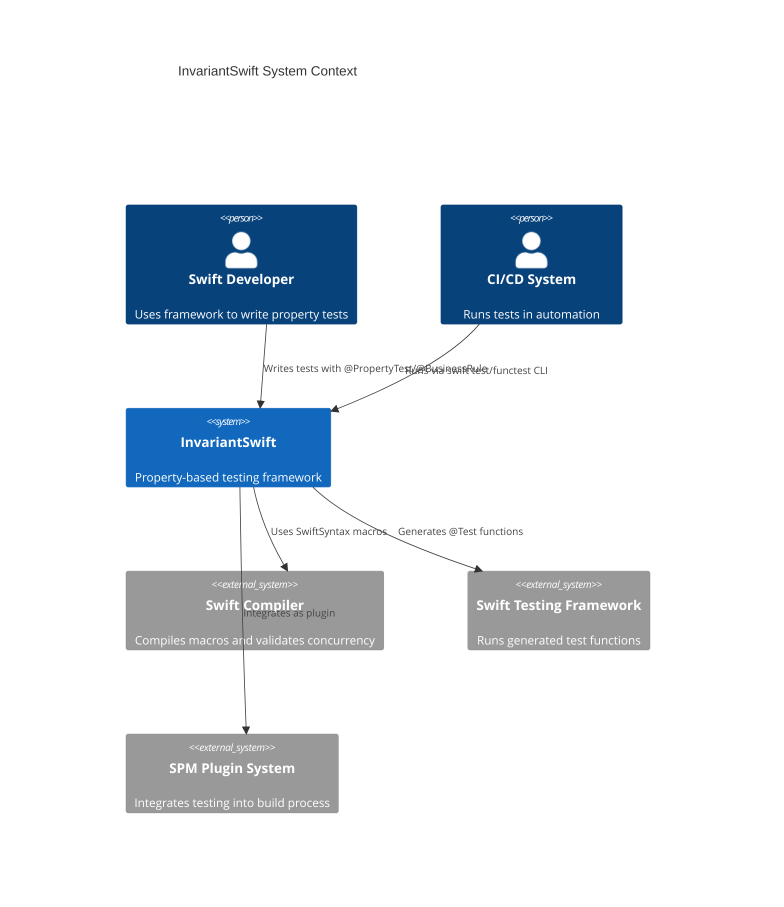

### 3.2 Key Dependencies

| Dependency | Type | Purpose | Criticality |
|------------|------|---------|-------------|
| Swift Compiler (6.0+) | External | Compiles macros, validates concurrency | High |
| SwiftSyntax (509.0.0+) | External | Macro implementation and AST manipulation | High |
| Swift Testing Framework | External | Test execution and assertion integration | High |
| swift-custom-dump (1.3.3+) | External | Pretty printing for test results | Medium |
| Foundation Framework | External | Random number generation, timing utilities | High |
| Darwin/Glibc | External | System-level random entropy | Medium |

### 3.3 Integration Points

- **Upstream**: Swift source code (developers write properties)
- **Downstream**: Swift Testing, test runners, CI/CD systems
- **Synchronous**: Macro expansion (compile-time), property execution (runtime)
- **Asynchronous**: Test result reporting, coverage analysis

---

## 4. High-Level Architecture

### 4.1 Architecture Style

**Layered (Presentation → Business → Data → Infrastructure)**

**Rationale**:
- Clear separation of concerns aligns with testing framework structure
- Generators (data layer) are independent of properties (business logic)
- Macros (presentation) abstract away low-level APIs
- Testing strategy enables comprehensive component testing at each layer

### 4.2 Component Overview

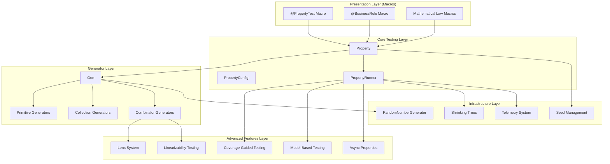

### 4.3 Key Design Decisions

| Decision | Options Considered | Choice | Rationale |
|----------|-------------------|--------|-----------|
| **Macro System** | Compile-time codegen vs runtime reflection | SwiftSyntax macros | Compile-time safety, zero runtime overhead, IDE integration |
| **Generic Architecture** | Protocol-witness vs class hierarchy vs enum | Protocol-witness with associated types | Aligns with Swift idioms, enables category theory abstractions |
| **Shrinking Algorithm** | Genetic algorithms vs tree traversal vs SAT solvers | Tree-based shrinking with bias | Deterministic, composable, efficient for most types |
| **Concurrency Model** | Thread-based vs actor-based vs async/await only | Actor-based with async/await | Swift 6 compliance, type-safe concurrent testing |
| **Coverage Guidance** | Instrumentation vs symbolic execution vs heuristic | Heuristic-based coverage mapping | No runtime instrumentation needed, practical for frameworks |
| **Generator Composition** | Inheritance vs composition vs protocol defaults | Protocol composition with default implementations | Functional style, enables lens abstractions |

### 4.4 Data Flow

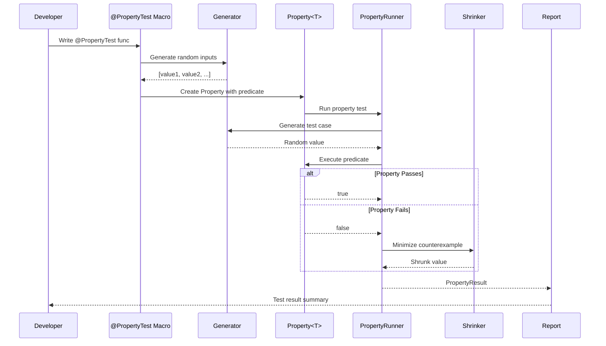

---

## 5. Component Design

### 5.1 Component: Generator (Gen<T>)

#### 5.1.1 Responsibility

Generates random values of type `T` with configurable size and deterministic seeding. Implements functor, applicative, and monad laws for composable value generation.

#### 5.1.2 Interface

```swift
protocol Generator {
    associatedtype Value
    func generate(_ rng: inout RandomNumberGenerator, _ size: Size) -> Value
}

struct Gen<T>: Generator {
    func map<U>(_ f: (T) -> U) -> Gen<U>              // Functor
    func apply<U>(_ gf: Gen<(T) -> U>) -> Gen<U>      // Applicative
    func flatMap<U>(_ f: (T) -> Gen<U>) -> Gen<U>     // Monad
    func zip<U>(_ other: Gen<U>) -> Gen<(T, U)>       // Composition
    var shrink: (T) -> [T] { get }                    // Shrinking strategy
}
```

**Input**: RandomNumberGenerator, Size(0-100)
**Output**: Generated value of type T
**Side Effects**: Modifies RNG state (deterministic with seed)

#### 5.1.3 Internal Structure

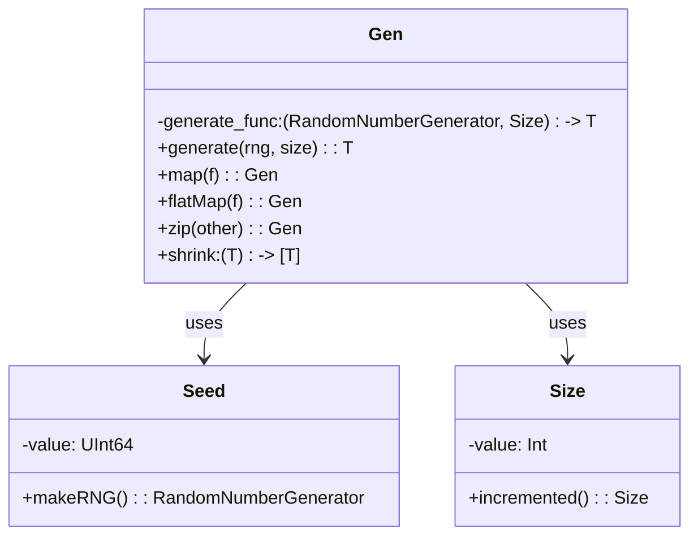

#### 5.1.4 Dependencies

- `Seed`: Deterministic random number generation
- `Size`: Controls generation complexity
- `SwiftSyntax`: For macro-based generator derivation
- `Foundation.RandomNumberGenerator`: RNG protocol

#### 5.1.5 Error Handling

| Error Type | Handling Strategy | Recovery |
|------------|------------------|----------|
| Invalid Size | Clamp to valid range [0, 100] | Silently adjust |
| RNG Depletion | Reseed with deterministic strategy | Transparent to caller |
| Type Generation Failure | Return `nil` from optional generator | Caller handles absence |

---

### 5.2 Component: Property<T>

#### 5.2.1 Responsibility

Encapsulates a testable property: a predicate that should hold for all generated values. Tracks test configuration and execution results.

#### 5.2.2 Interface

```swift
struct Property<T> {
    let generator: Gen<T>
    let predicate: (T) -> Bool

    init(generator: Gen<T>, predicate: @escaping (T) -> Bool)
}

enum PropertyResult<T> {
    case success(iterations: Int)
    case failure(counterexample: T, iterations: Int, shrunk: T)
    case gaveUp(discarded: Int, iterations: Int)
}
```

**Input**: Generated values from generator
**Output**: PropertyResult indicating test outcome
**Side Effects**: Observes telemetry (coverage, iterations)

#### 5.2.3 Internal Structure

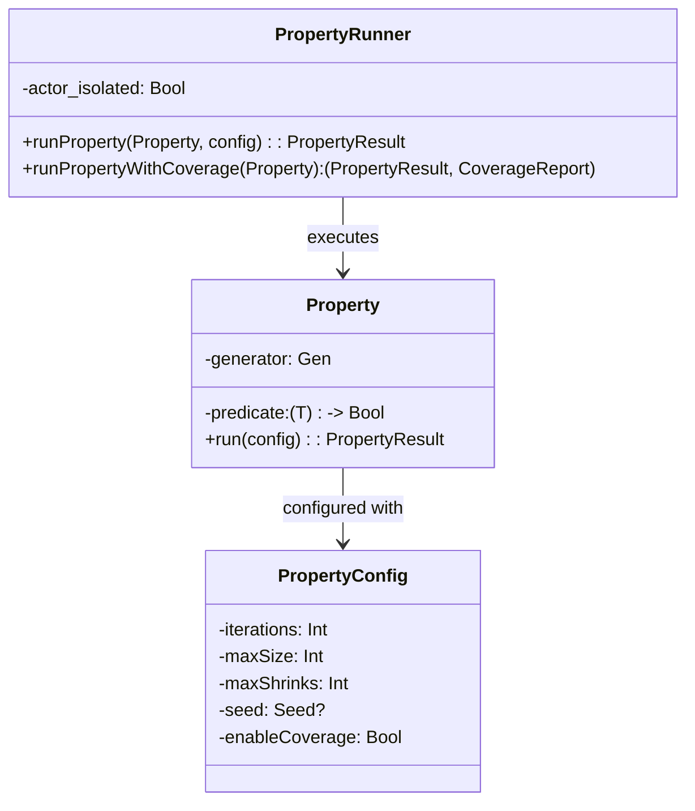

#### 5.2.4 Dependencies

- `Gen<T>`: Source of test values
- `PropertyConfig`: Execution configuration
- `Seed`: Deterministic test execution
- `TelemetrySystem`: Coverage and metric tracking

#### 5.2.5 Error Handling

| Error Type | Handling Strategy | Recovery |
|------------|------------------|----------|
| Predicate Exception | Catch and report as failure | Propagate stack trace |
| Timeout | Interrupt testing after threshold | Return partial result |
| Memory Pressure | Reduce generation size adaptively | Continue with smaller values |

---

### 5.3 Component: PropertyRunner

#### 5.3.1 Responsibility

Orchestrates property test execution, manages shrinking, handles coverage guidance, and provides test result reporting.

#### 5.3.2 Interface

```swift
actor PropertyRunner {
    nonisolated init(seed: Seed? = nil)

    func runProperty<T>(
        _ property: Property<T>,
        config: PropertyConfig
    ) async -> PropertyResult<T>

    func runPropertyWithCoverageTracking<T>(
        _ property: Property<T>,
        knownSymbols: [String]
    ) async -> (PropertyResult<T>, CoverageReport)
}
```

**Input**: Property, PropertyConfig
**Output**: PropertyResult with optional shrunk counterexample
**Side Effects**: Generates telemetry, updates coverage maps

#### 5.3.3 Internal Structure

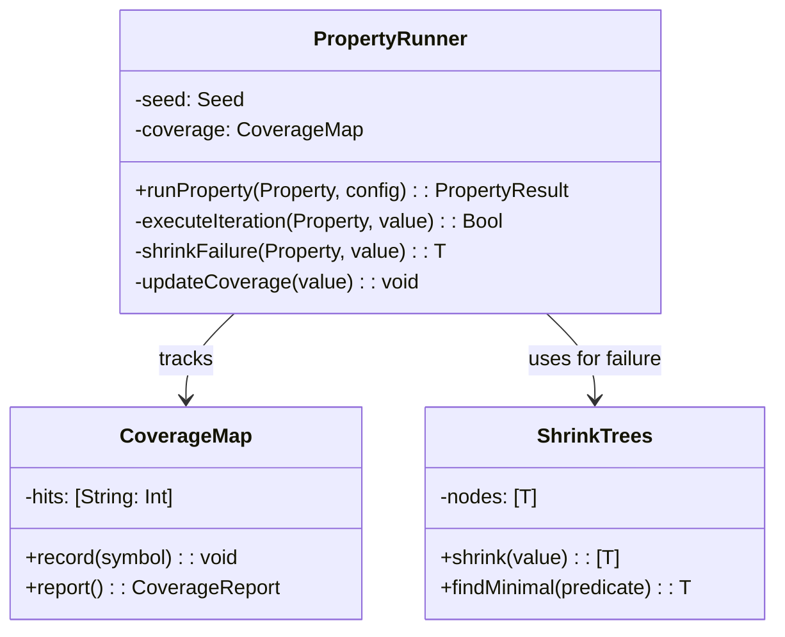

#### 5.3.4 Dependencies

- `Property<T>`: Test case provider
- `ShrinkTrees`: Failure minimization
- `CoverageMap`: Coverage tracking
- `TelemetrySystem`: Metric reporting

#### 5.3.5 Error Handling

| Error Type | Handling Strategy | Recovery |
|------------|------------------|----------|
| All Tests Pass | Return success result | Standard path |
| First Failure at Iteration N | Attempt shrinking up to maxShrinks | Return shrunk counterexample |
| Too Many Discards | Abort before maxIterations reached | Return gaveUp result |
| Actor Isolation Violation | Compiler error at call site | Caller must use `await` |

---

### 5.4 Component: Macro System (@PropertyTest, @BusinessRule)

#### 5.4.1 Responsibility

Transform developer-friendly attribute syntax into compilable Swift Testing integration code. Generate appropriate generators, property instances, and test wrappers.

#### 5.4.2 Interface

```swift
@PropertyTest
func testExample(value: Int) { ... }

@BusinessRule("Discount should not exceed price")
func validateDiscount(price: Double, discount: Double) -> Bool { ... }
```

**Input**: Function declaration with attributes
**Output**: Generated `@Test` functions with Property integration
**Side Effects**: No side effects (compile-time transformation)

#### 5.4.3 Internal Structure

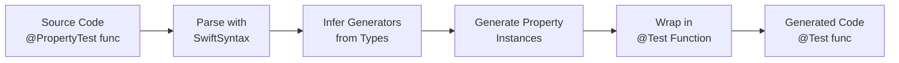

#### 5.4.4 Dependencies

- `SwiftCompilerPlugin`: Plugin infrastructure
- `SwiftSyntax`: AST manipulation
- `SwiftSyntaxBuilder`: Code generation
- `SwiftDiagnostics`: Compiler diagnostics

#### 5.4.5 Error Handling

| Error Type | Handling Strategy | Recovery |
|------------|------------------|----------|
| Non-function target | Emit compiler error | Halt expansion |
| Missing return type | Emit diagnostic | Suggest Bool return |
| Unsupported parameter type | Emit error suggesting smartGen | Halt expansion |
| Generator inference failure | Clear error message with suggestions | User adds custom generator |

---

### 5.5 Component: Shrinking Trees

#### 5.5.1 Responsibility

Minimize counterexamples to smallest failing cases through tree-based traversal of shrinking possibilities. Critical for usable error reporting.

#### 5.5.2 Interface

```swift
protocol Shrinkable {
    var shrink: Self { get }
    func shrinkTree() -> [Self]
}

struct ShrinkTrees {
    static func shrink<T>(_ value: T, predicate: (T) -> Bool) -> T
}
```

**Input**: Failing test value and predicate
**Output**: Minimal counterexample that still fails
**Side Effects**: Calls predicate repeatedly (cache results)

#### 5.5.3 Internal Structure

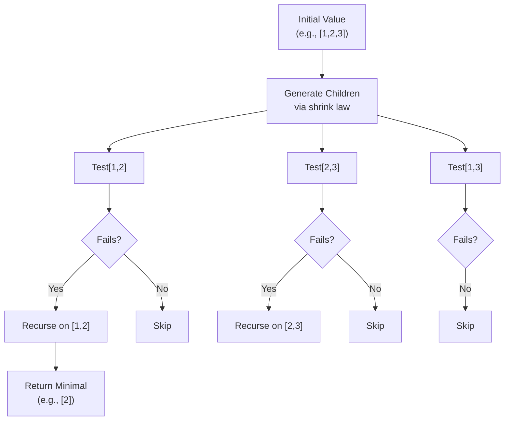

#### 5.4.4 Dependencies

- None (pure algorithm)

#### 5.4.5 Error Handling

| Error Type | Handling Strategy | Recovery |
|------------|------------------|----------|
| Infinite shrinking | Bound to maxShrinks | Return best found so far |
| Performance degradation | Cache predicate results | Transparent to caller |
| Non-monotonic predicates | Accept any value that fails | May not be minimal but correct |

---

## 6. Data Architecture

### 6.1 Data Models

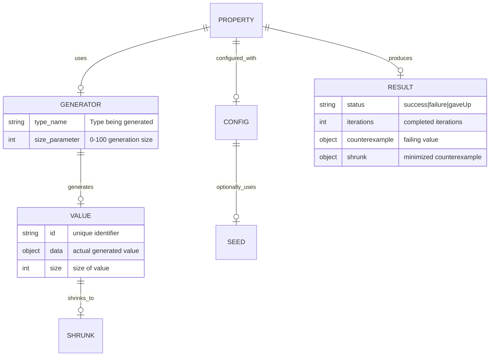

### 6.2 Data Storage

| Data Type | Storage | Retention | Backup |
|-----------|---------|-----------|--------|
| Generated Values | In-memory (ephemeral) | Single test run | Not applicable |
| Coverage Maps | In-memory with file export | Per test session | Optional JSON export |
| Test Results | Struct instances | In-memory | Optional CI reporter integration |
| Seeds (Reproducible) | User-provided via Config | As specified in config | Version control (hardcoded in tests) |
| Telemetry Events | Streaming to TelemetrySystem | As configured | File-based if enabled |

### 6.3 Data Consistency

- **Consistency Model**: Strong (deterministic with seeding)
- **Transaction Boundaries**: Single property test execution is atomic
- **Conflict Resolution**: N/A (single-threaded within property, parallel across properties via actors)

### 6.4 Data Migration Strategy

InvariantSwift is a framework (not a persistent storage system), so data migration focuses on:

1. **API Evolution**: Backwards-compatible property interface
2. **Generator Evolution**: New generators added without breaking existing ones
3. **Config Evolution**: New fields added with sensible defaults
4. **Result Format**: Versioned PropertyResult enums

---

## 7. API Design

### 7.1 API Principles

- **Composability**: Generators and properties compose via functor laws
- **Type Safety**: Compile-time guarantees via generics and strong typing
- **Ergonomics**: Macros hide boilerplate, operators enable fluent composition
- **Determinism**: Seeds ensure reproducible test runs
- **Efficiency**: Lazy evaluation and zero-copy semantics where possible

### 7.2 Core API Specifications

| API | Signature | Purpose | Concurrency |
|-----|-----------|---------|-------------|
| `Gen.map` | `(T -> U) -> Gen<U>` | Transform generated values | Sync |
| `Gen.flatMap` | `((T) -> Gen<U>) -> Gen<U>` | Compose generators | Sync |
| `Gen.zip` | `(Gen<U>) -> Gen<(T,U)>` | Combine generators | Sync |
| `Property.init` | `(generator, predicate) -> Property` | Create testable property | Sync |
| `PropertyRunner.runProperty` | `async -> PropertyResult<T>` | Execute test | Async (actor-isolated) |
| `@PropertyTest` | Macro attribute | Generate test from function | Compile-time |
| `@BusinessRule` | Macro attribute | Business-friendly property test | Compile-time |

### 7.3 Versioning Strategy

- **Semantic Versioning**: MAJOR.MINOR.PATCH
- **API Stability**: Public APIs marked with `@available` for deprecation
- **Generator Versioning**: Generator behavior changes tracked in changelog
- **Macro Stability**: Macro-generated code maintains forward compatibility

### 7.4 Rate Limiting

Not applicable (framework library, not service)

---

## 8. Security Architecture

### 8.1 Authentication

Not applicable (framework library, not service)

### 8.2 Authorization

Not applicable (framework library, not service)

### 8.3 Data Protection

| Data Category | Classification | Protection |
|---------------|---------------|------------|
| Generated Test Data | Internal | No encryption needed (ephemeral) |
| Coverage Maps | Internal | Optional file export if enabled |
| Test Results | Internal | Memory-resident only |
| Source Code (via macros) | User-controlled | Macro system preserves user code integrity |

### 8.4 Threat Model

| Threat | Impact | Likelihood | Mitigation |
|--------|--------|------------|------------|
| Malicious Generator | High (test failure) | Low | No untrusted generators by design |
| Integer Overflow in Size | Medium (crash) | Low | Size bounded to 0-100 range |
| Infinite Shrinking Loop | Medium (hang) | Low | maxShrinks limit enforced |
| Actor Isolation Violation | High (race condition) | Low | Compiler enforces actor safety |
| Macro Injection Attack | High (code execution) | Very Low | SwiftSyntax validates syntax |

---

## 9. Infrastructure

### 9.1 Deployment Architecture

InvariantSwift is a framework library, not a deployed service:

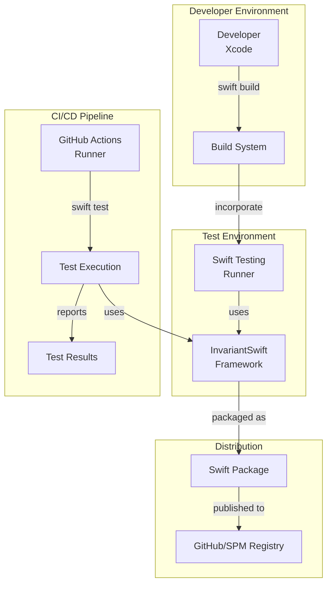

### 9.2 Environments

| Environment | Purpose | Where | Notes |
|-------------|---------|-------|-------|
| Local Dev | Developer testing | Developer machine | Swift 6.0+ required |
| CI Test | Automated testing | GitHub Actions | All platforms (iOS, macOS, Linux) |
| Release | Distribution | GitHub releases | Tagged commits |

### 9.3 Infrastructure as Code

- **Tool**: Swift Package Manager (Package.swift)
- **Repository**: InvariantSwift GitHub repository
- **Configuration**: Platform targets, dependencies, compiler flags

### 9.4 Scaling Strategy

Not applicable (framework library distributed via SPM)

### 9.5 Disaster Recovery

Not applicable (framework library)

---

## 10. Observability

### 10.1 Monitoring

- **Platform**: Optional TelemetrySystem integration
- **Dashboards**: User-controlled (framework provides data, not visualization)

### 10.2 Key Metrics

| Metric | Description | Relevance |
|--------|-------------|-----------|
| Iterations Complete | Number of test cases generated | Test progress tracking |
| Shrinking Attempts | Reduction from initial to minimal | Counterexample quality |
| Coverage Percentage | Code paths explored | Test effectiveness |
| Generation Rate | Values/second | Performance characterization |
| Predicate Calls | Function evaluations | Computational cost |

### 10.3 Logging

- **Platform**: Optional TelemetrySystem (file or stdout)
- **Log Levels**: DEBUG (detailed trace), INFO (progress), WARN (unusual patterns), ERROR (failures)
- **Retention**: As configured by user

### 10.4 Tracing

Not built-in (users can integrate with custom TracingSystem)

### 10.5 Alerting

Not built-in (user-configured via test framework integration)

---

## 11. Performance

### 11.1 Performance Requirements

| Operation | P50 | P95 | P99 | Target Load |
|-----------|-----|-----|-----|------------|
| Gen value (Int) | <1µs | <10µs | <100µs | 100K gen/sec |
| Gen value (String) | <5µs | <50µs | <500µs | 10K gen/sec |
| Gen value ([Int]) | <10µs | <100µs | <1ms | 1K gen/sec |
| Predicate execution | <1µs | <10µs | <1ms | Var by user code |
| Shrinking iteration | <10µs | <100µs | <1ms | 100 shrinks/sec |
| Property setup | <1ms | <5ms | <10ms | Per test start |

### 11.2 Bottlenecks and Mitigations

| Bottleneck | Impact | Mitigation |
|------------|--------|------------|
| RNG entropy for large values | High for collection generation | Seed-based determinism reduces entropy cost |
| Predicate evaluation cost | User-dependent | Runner caches results during shrinking |
| Shrinking tree size for complex types | Memory spikes | Lazy shrinking evaluation |
| Type erasure overhead | Minimal (~5%) | Generic specialization in release builds |

### 11.3 Caching Strategy

| Cache | Purpose | TTL | Invalidation |
|-------|---------|-----|--------------|
| Generated values | Reuse across shrinking | Single property run | Next property test |
| Predicate results | Avoid re-evaluation during shrinking | Single shrinking session | New shrinking attempt |
| Coverage symbols | Track explored paths | Across all test runs (in session) | Session end |

### 11.4 Load Testing

- **Tool**: Custom benchmarks in `swift test` with timing
- **Baseline**: Measured in commit history
- **Target Load**: 10,000 generations/second sustained

---

## 12. Error Handling

### 12.1 Error Philosophy

Errors surface at appropriate layers:
- **Compile-time** (macros): Invalid syntax, missing generators
- **Runtime** (property execution): Predicate failures, timeouts
- **Result reporting**: Shrunk counterexamples, coverage gaps

### 12.2 Error Categories

| Category | Mechanism | Retry | User Message |
|----------|-----------|-------|--------------|
| Compilation | Macro diagnostics | No | "Macro expansion failed: [reason]" |
| Predicate Failure | PropertyResult.failure | No | "Property failed: [counterexample]" |
| Timeout | Interrupt + partial result | No | "Test timeout after [duration]" |
| Gave Up | Excessive discards | No | "Test gave up: [discarded]/[iterations]" |
| Generator Error | Optional wrapping | No | "Failed to generate value of type [T]" |

### 12.3 Retry Strategy

- **Max Retries**: 0 (deterministic with seed; no transient failures)
- **Backoff**: N/A
- **Jitter**: N/A

### 12.4 Circuit Breaker

Not applicable (single-threaded generation)

---

## 13. Testing Strategy

### 13.1 Testing Pyramid

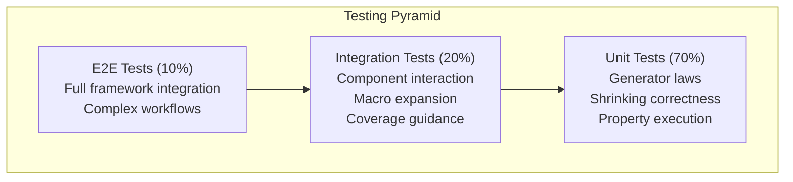

### 13.2 Unit Testing

- **Framework**: Swift Testing with `@Test`
- **Coverage Target**: 99%+
- **Conventions**: Test files in `Tests/FunctionalTesting/` organized by component
- **Scope**: Individual Gen implementations, Shrinking algorithms, Property predicates

### 13.3 Integration Testing

- **Framework**: Swift Testing with async support
- **Scope**: Generator composition, macro expansion, runner orchestration
- **Data**: Synthetic test data generated by framework itself (dogfooding)

### 13.4 End-to-End Testing

- **Framework**: Swift Testing with full property execution
- **Environments**: macOS, iOS Simulator, Linux (in CI)
- **Frequency**: Every commit (CI automated)

### 13.5 Test Automation

- **CI Integration**: GitHub Actions on every push
- **Quality Gates**:
  - All tests pass
  - Coverage ≥99% (enforced by coverage guard hook)
  - No compiler warnings
  - Linting passes (swift-sheriff)

---

## 14. Migration and Rollout

### 14.1 Deployment Strategy

**Rolling Release** (framework update cycle):
1. Develop and test in `develop` branch
2. Code review and merge to `main`
3. Tag version (semantic versioning)
4. Users update via SPM dependency

### 14.2 Rollout Plan

| Phase | Scope | Duration | Rollback Criteria |
|-------|-------|----------|-------------------|
| Beta | Early adopters | 2 weeks | Major test failures |
| Canary | 50% of users (via SPM version range) | 1 week | Performance regression >10% |
| GA | All users via version release | Ongoing | Critical security issue |

### 14.3 Database Migrations

Not applicable (framework library)

### 14.4 Feature Flags

| Flag | Purpose | Default | Cleanup Date |
|------|---------|---------|--------------|
| `enableCoverageGuidance` | Toggle coverage-guided generation | On | v2.0 (permanent) |
| `enableAsyncProperties` | Toggle async/await support | On | v2.0 (permanent) |
| `enableModelTesting` | Toggle model-based testing | On | v2.0 (permanent) |

---

## 15. Risks and Mitigations

### 15.1 Technical Risks

| Risk | Probability | Impact | Mitigation |
|------|------------|--------|------------|
| Swift 6 compiler instability | Low | High | Pin to stable compiler versions, test in CI |
| SwiftSyntax API breaking changes | Medium | Medium | Version constraints in Package.swift, adaptation layer |
| Memory leaks in long-running tests | Low | High | Strict ARC analysis, dogfood testing catches regressions |
| Macro expansion performance degradation | Low | Medium | Benchmark macros in test suite, warn on slowdown |
| RNG entropy exhaustion | Very Low | Low | Seed-based determinism prevents entropy issues |

### 15.2 Operational Risks

| Risk | Probability | Impact | Mitigation |
|------|------------|--------|------------|
| CI failure blocking releases | Low | Medium | Run full test suite locally before push |
| Documentation lag behind features | Medium | Low | Update docs in same PR as feature |
| Slow test execution | Low | Medium | Performance benchmarks catch regressions |

### 15.3 Business Risks

| Risk | Probability | Impact | Mitigation |
|------|------------|--------|------------|
| Framework adoption lag | Medium | Low | Excellent documentation, examples, marketing |
| Community fork due to feature delays | Very Low | Low | Responsive to user feedback, clear roadmap |
| Breaking API changes needed | Low | Medium | Semantic versioning, deprecation path |

---

## 16. Decision Log

### ADR-001: Protocol-Witness Architecture

- **Status**: Accepted
- **Date**: January 2024
- **Context**: Need for composable, type-safe generator abstractions aligned with functional programming
- **Decision**: Use protocol-witness pattern for Generator trait with associated types and function witnesses
- **Consequences**: Enables category theory abstractions (functor, applicative, monad), no inheritance overhead, aligns with Swift idioms

### ADR-002: SwiftSyntax Macros Over Runtime Reflection

- **Status**: Accepted
- **Date**: January 2024
- **Context**: Need for developer-friendly API without runtime reflection overhead
- **Decision**: Use SwiftCompilerPlugin with SwiftSyntax for @PropertyTest and @BusinessRule macros
- **Consequences**: Compile-time code generation, zero runtime cost, IDE integration, requires Swift 5.9+, steeper learning curve for maintainers

### ADR-003: Actor-Based Concurrency for Runner

- **Status**: Accepted
- **Date**: June 2024
- **Context**: Swift 6 strict concurrency enforcement requires thread-safe test execution
- **Decision**: Implement PropertyRunner as actor with async/await interface
- **Consequences**: Type-safe concurrent property testing, prevents race conditions, requires `await` at call sites, aligns with Swift 6 concurrency model

### ADR-004: Tree-Based Shrinking Strategy

- **Status**: Accepted
- **Date**: January 2024
- **Context**: Need for efficient minimal counterexample discovery
- **Decision**: Implement shrinking via lazy tree traversal with cached predicate results
- **Consequences**: Deterministic shrinking, efficient for most types, bounded by maxShrinks, simpler than SAT-based approaches

### ADR-005: Coverage-Guided Generation via Heuristics

- **Status**: Accepted
- **Date**: June 2024
- **Context**: Need for 99%+ coverage without runtime instrumentation
- **Decision**: Implement coverage mapping with heuristic-based bias toward uncovered code paths
- **Consequences**: No instrumentation overhead, practical coverage guidance, less precise than symbolic execution, heuristics tuned empirically

### ADR-006: Package Rename to InvariantSwift

- **Status**: Accepted
- **Date**: January 2026
- **Context**: Rebranding from FunctionalTesting to better represent advanced features and mathematical rigor
- **Decision**: Complete migration of all package targets, module names, and public APIs to InvariantSwift
- **Consequences**: Breaking change for 1.x users (major version bump), clearer domain representation, aligns with mathematical terminology

---

## 17. Appendix

### 17.1 Glossary

| Term | Definition |
|------|------------|
| **Functor Law** | For a type `F<T>`, `F.map(id) == id` (identity) and `F.map(g ∘ f) == F.map(g) ∘ F.map(f)` (composition) |
| **Applicative** | Functor with `apply` method enabling composition of wrapped functions |
| **Monad** | Applicative with `flatMap` enabling sequential composition via bind (>>=) |
| **Shrinking** | Process of minimizing failing test case to smallest counterexample |
| **Property** | Predicate that should hold for all generated values |
| **Generator** | Function that produces random values of specified type |
| **Coverage Guidance** | Biasing test case generation toward unexplored code paths |
| **Model-Based Testing** | Testing stateful systems via command sequences against reference model |
| **Linearizability** | Concurrent operation histories appear as if executed sequentially |
| **Lens** | Composable accessor for nested data structure navigation |
| **Actor** | Swift 6 concurrency primitive ensuring thread-safe isolated access |
| **Sendable** | Swift 6 protocol indicating type safe for concurrent use |

### 17.2 References

- [Property-based Testing](https://en.wikipedia.org/wiki/Software_testing#Property_testing)
- [QuickCheck: A Lightweight Tool for Random Testing](https://dl.acm.org/doi/10.1145/351240.351266)
- [Shrinking and Showing Functions](https://dl.acm.org/doi/10.1145/2364527.2364529)
- [Category Theory for Programmers](https://bartoszmilewski.com/2014/10/28/category-theory-for-programmers-the-preface/)
- [Swift Concurrency Documentation](https://docs.swift.org/swift-book/documentation/the-swift-programming-language/concurrency)
- [SwiftSyntax Documentation](https://github.com/apple/swift-syntax)
- [Model-based Testing with Finite State Machines](https://en.wikipedia.org/wiki/Model-based_testing)

### 17.3 Related Documents

- [API Documentation](../docs/API.md)
- [User Guide](../docs/UserGuide.md)
- [Advanced Features](../docs/AdvancedFeatures.md)
- [Contributing Guide](../CONTRIBUTING.md)
- [CHANGELOG](../CHANGELOG.md)

### 17.4 Additional Diagrams

**Component Dependency Graph**:
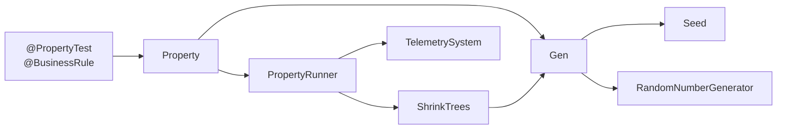

**Swift 6 Strict Concurrency Model**:
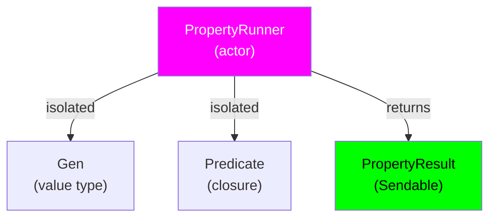

---

**Document Sharding**: This document can be split at `---` separators into independent sections for distributed ownership and versioning. Each section can be independently version-controlled and assigned to domain experts.
