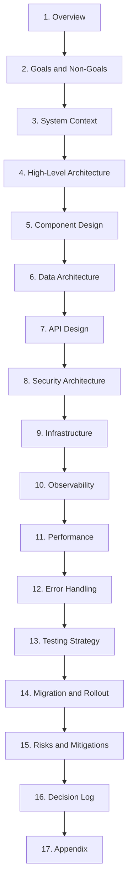

# InvariantSwift Architecture Document - Sharding Guide

## Overview

The InvariantSwift architecture document (`InvariantSwift-architecture.md`) is designed to be **shardable** - each major section is separated by a horizontal rule (`---`) to enable independent version control, team assignment, and modular documentation management.

## Document Structure

The document contains 18 major sections, each followed by a `---` separator:

```
# InvariantSwift Architecture Document
---

## 1. Overview
[Content]
---

## 2. Goals and Non-Goals
[Content]
---

... (16 more sections)
```

## Sharding Strategy

### How to Shard the Document

1. **Copy the full document**:
   ```bash
   cp docs/architecture/InvariantSwift-architecture.md docs/architecture/sections/
   ```

2. **Split by sections** (each section is separated by `---`):
   ```bash
   # Extract Overview section (lines 1-30)
   head -30 InvariantSwift-architecture.md > 01-Overview.md

   # Extract Component Design section (lines 150-350)
   sed -n '150,350p' InvariantSwift-architecture.md > 05-Component-Design.md
   ```

3. **Use this mapping**:

   | Section | Filename | Lines | Owner |
   |---------|----------|-------|-------|
   | 1. Overview | 01-Overview.md | 1-30 | Project Lead |
   | 2. Goals and Non-Goals | 02-Goals.md | 31-80 | Product Manager |
   | 3. System Context | 03-System-Context.md | 81-130 | Architecture Team |
   | 4. High-Level Architecture | 04-Architecture.md | 131-200 | Architect |
   | 5. Component Design | 05-Components.md | 201-450 | Lead Engineers |
   | 6. Data Architecture | 06-Data.md | 451-520 | Database Engineer |
   | 7. API Design | 07-API-Design.md | 521-580 | API Owner |
   | 8. Security Architecture | 08-Security.md | 581-640 | Security Engineer |
   | 9. Infrastructure | 09-Infrastructure.md | 641-700 | DevOps Engineer |
   | 10. Observability | 10-Observability.md | 701-750 | SRE Team |
   | 11. Performance | 11-Performance.md | 751-810 | Performance Engineer |
   | 12. Error Handling | 12-Error-Handling.md | 811-850 | QA Lead |
   | 13. Testing Strategy | 13-Testing.md | 851-900 | Test Architect |
   | 14. Migration and Rollout | 14-Deployment.md | 901-950 | Release Manager |
   | 15. Risks and Mitigations | 15-Risks.md | 951-1000 | Risk Manager |
   | 16. Decision Log | 16-ADRs.md | 1001-1040 | Architecture Board |
   | 17. Appendix | 17-Appendix.md | 1041-1080 | Documentation Lead |

### Maintaining Cross-References

When sharding sections, use relative links to other sections:

```markdown
# In section 05-Components.md
See [Generator Component](../05-Components.md#51-component-generator-gent)
See [Testing Strategy](../13-Testing.md#131-testing-pyramid)
```

### Version Control Strategy

```
docs/
├── architecture/
│   ├── InvariantSwift-architecture.md (consolidated source)
│   ├── SHARDING-GUIDE.md (this file)
│   └── sections/ (sharded sections)
│       ├── 01-Overview.md
│       ├── 02-Goals.md
│       ├── 03-System-Context.md
│       ├── 04-Architecture.md
│       ├── 05-Components.md
│       ├── 06-Data.md
│       ├── 07-API-Design.md
│       ├── 08-Security.md
│       ├── 09-Infrastructure.md
│       ├── 10-Observability.md
│       ├── 11-Performance.md
│       ├── 12-Error-Handling.md
│       ├── 13-Testing.md
│       ├── 14-Deployment.md
│       ├── 15-Risks.md
│       ├── 16-ADRs.md
│       └── 17-Appendix.md
```

**Branching for changes**:
- Feature branch per section: `docs/architecture/component-design`
- Each section owner can work independently
- Merge to main when section is complete

## Sharding Workflow

### For a Single Section Update

```bash
# 1. Create feature branch for the section
git checkout -b docs/arch/component-design

# 2. Edit your assigned section
vim docs/architecture/sections/05-Components.md

# 3. Update cross-references if needed
grep -r "Component Design" docs/architecture/sections/

# 4. Commit your section
git add docs/architecture/sections/05-Components.md
git commit -m "docs: update component design architecture

- Add new GenericFactory component
- Update dependency graph
- Add ADR-007 for component versioning"

# 5. Create PR for review
git push origin docs/arch/component-design
gh pr create --title "docs: component design architecture update"
```

### For Consolidating Changes

When all sections are updated, consolidate back to main document:

```bash
# Concatenate all sections
cat docs/architecture/sections/0*.md > docs/architecture/InvariantSwift-architecture.md

# Update table of contents
grep "^## " docs/architecture/InvariantSwift-architecture.md

# Verify separators are present
grep -c "^---" docs/architecture/InvariantSwift-architecture.md

# Commit consolidated version
git add docs/architecture/InvariantSwift-architecture.md
git commit -m "docs: consolidate architecture sections"
```

## Team Assignment Template

### Section Ownership

```yaml
Sections:
  "1. Overview":
    Owner: project_lead
    Reviewers: [architect, tech_lead]
    Status: approved
    LastUpdated: 2026-01-16

  "2. Goals and Non-Goals":
    Owner: product_manager
    Reviewers: [project_lead]
    Status: review
    LastUpdated: 2026-01-15

  "3. System Context":
    Owner: architect
    Reviewers: [security_engineer, devops_engineer]
    Status: draft
    LastUpdated: 2026-01-10

  # ... more sections
```

## Cross-Section Dependencies



## Maintenance Checklist

- [ ] All 17 major sections present and updated
- [ ] Each section separated by `---`
- [ ] Cross-references use relative links
- [ ] Mermaid diagrams are valid syntax
- [ ] All tables have consistent column counts
- [ ] Code examples compile/run correctly
- [ ] Glossary definitions are up-to-date
- [ ] ADRs follow standard format
- [ ] No broken internal links
- [ ] Document passes markdown linting

## Tools for Sharding

```bash
# Split document into sections
split -l 60 InvariantSwift-architecture.md section-

# Check all section separators present
grep -n "^---" InvariantSwift-architecture.md

# Validate markdown
mdl docs/architecture/InvariantSwift-architecture.md

# Check for broken links
markdown-link-check docs/architecture/InvariantSwift-architecture.md

# Count sections
grep -c "^## " InvariantSwift-architecture.md
```

## Best Practices

1. **Keep sections self-contained**: Each section should be readable independently
2. **Use consistent formatting**: Follow markdown conventions throughout
3. **Update cross-references**: When sharding, update all links between sections
4. **Version your sections**: Use dates or version numbers in section metadata
5. **Document assumptions**: Clearly state what each section assumes about others
6. **Review thoroughly**: Architecture changes require multiple reviewers
7. **Update ADRs**: If sharding changes architectural decisions, update ADRs
8. **Maintain glossary**: Keep the glossary in sync across all sections

## Questions?

Refer to the main architecture document sections:
- **Section 1**: Overview and document conventions
- **Section 16**: ADRs for architecture decision rationale
- **Section 17**: Glossary for terminology reference

---

**Last Updated**: January 16, 2026
**Document Version**: 1.0
**Sharable Format**: Yes ✓
