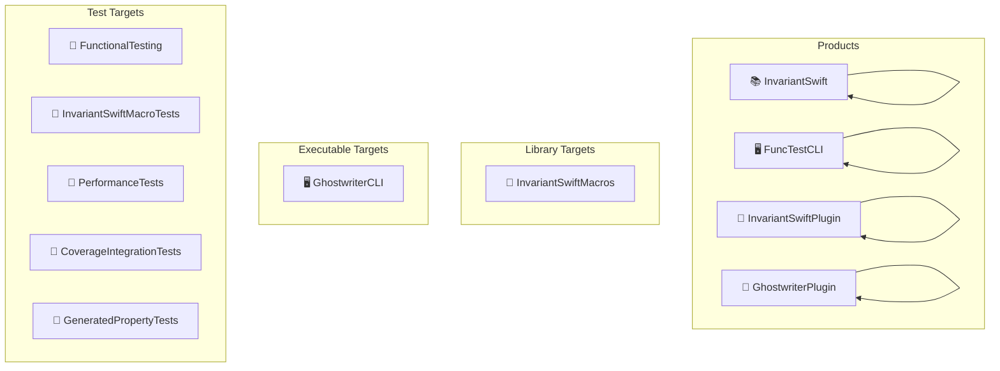
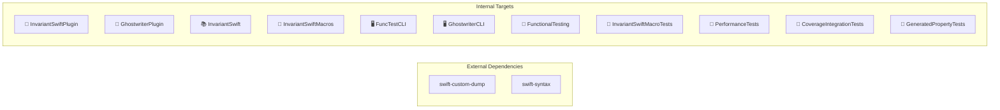
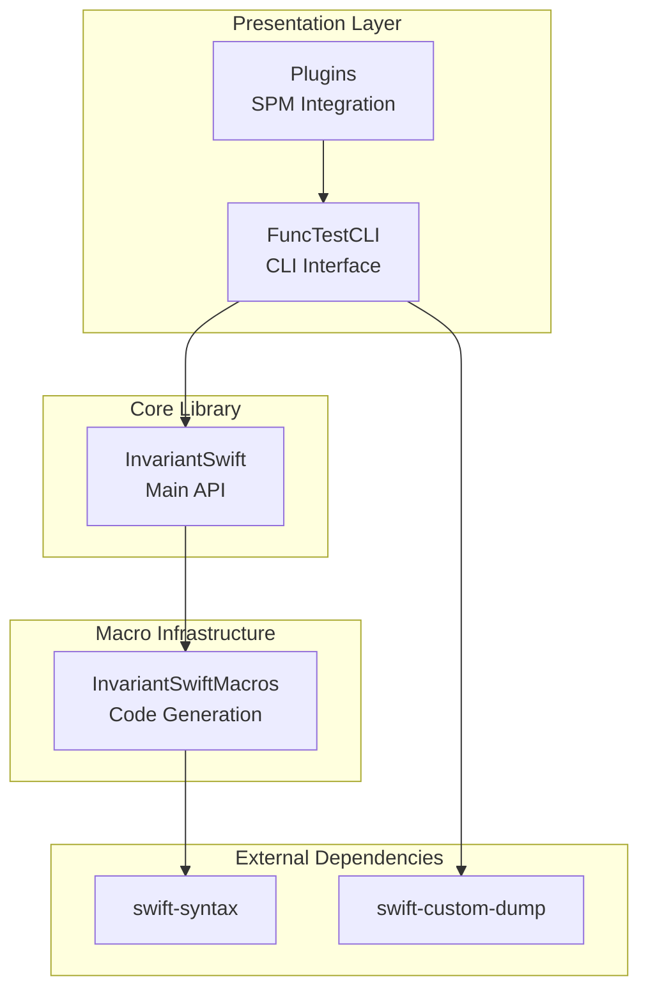

# InvariantSwift Architecture Diagrams

_Auto-generated by `Scripts/generate_architecture_diagrams.py`_

## Package Structure

Overview of products and their target mappings:

## Target Dependencies

How targets depend on each other and external packages:

## Layered Architecture

Conceptual layers of the framework:

## Target Summary

| Target | Type | Dependencies |
|--------|------|--------------|
| InvariantSwiftPlugin | plugin | _none_ |
| GhostwriterPlugin | plugin | _none_ |
| InvariantSwift | target | _none_ |
| InvariantSwiftMacros | macro | _none_ |
| FuncTestCLI | executableTarget | _none_ |
| InvariantSwiftPlugin | plugin | _none_ |
| GhostwriterPlugin | plugin | _none_ |
| GhostwriterCLI | executableTarget | _none_ |
| FunctionalTesting | testTarget | _none_ |
| InvariantSwiftMacroTests | testTarget | _none_ |
| PerformanceTests | testTarget | _none_ |
| CoverageIntegrationTests | testTarget | _none_ |
| GeneratedPropertyTests | testTarget | _none_ |

## External Dependencies

| Package | Purpose |
|---------|---------|
| swift-syntax | Macro expansion and code analysis |
| swift-custom-dump | Pretty-printing and diff output |

---

_Generated: Auto-updated on package changes_
