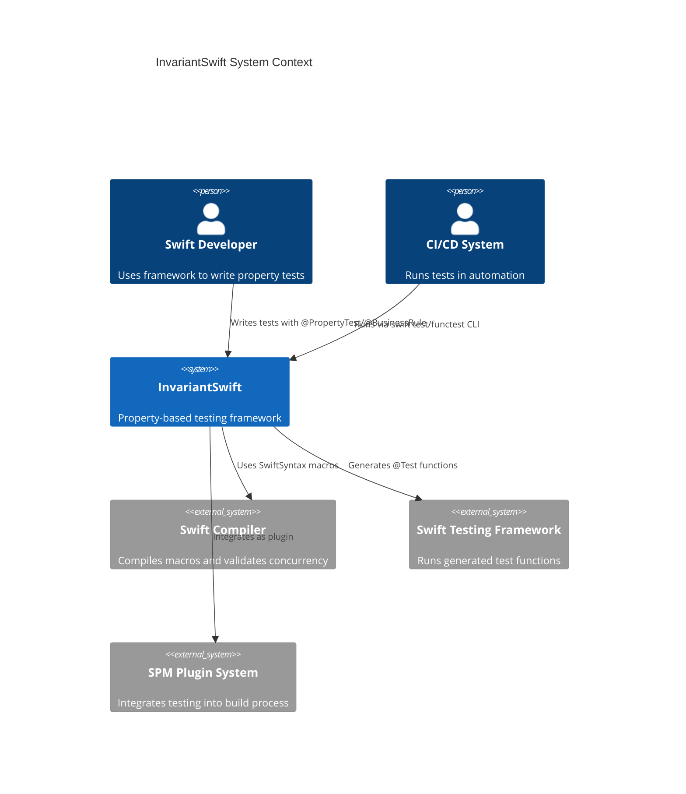

# System Context

### 3.1 System Boundaries

### 3.2 Key Dependencies

| Dependency | Type | Purpose | Criticality |
|------------|------|---------|-------------|
| Swift Compiler (6.0+) | External | Compiles macros, validates concurrency | High |
| SwiftSyntax (509.0.0+) | External | Macro implementation and AST manipulation | High |
| Swift Testing Framework | External | Test execution and assertion integration | High |
| swift-custom-dump (1.3.3+) | External | Pretty printing for test results | Medium |
| Foundation Framework | External | Random number generation, timing utilities | High |
| Darwin/Glibc | External | System-level random entropy | Medium |

### 3.3 Integration Points

- **Upstream**: Swift source code (developers write properties)
- **Downstream**: Swift Testing, test runners, CI/CD systems
- **Synchronous**: Macro expansion (compile-time), property execution (runtime)
- **Asynchronous**: Test result reporting, coverage analysis

---
