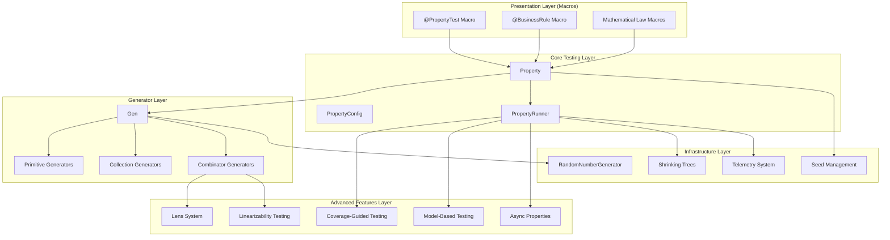
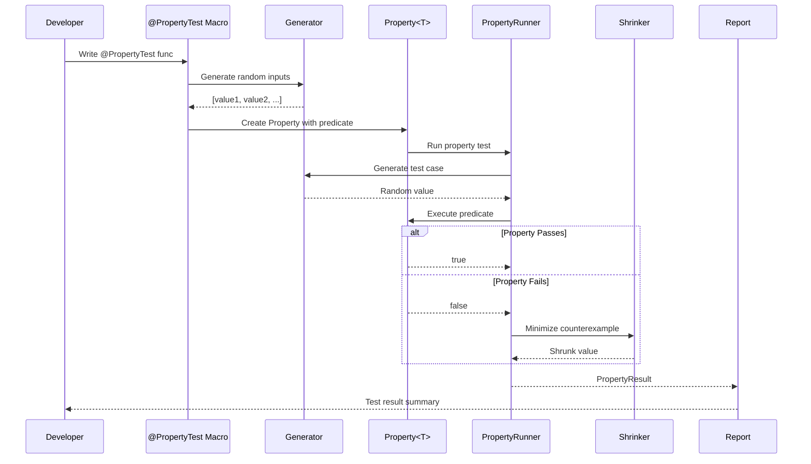

# High-Level Architecture

### 4.1 Architecture Style

**Layered (Presentation → Business → Data → Infrastructure)**

**Rationale**:
- Clear separation of concerns aligns with testing framework structure
- Generators (data layer) are independent of properties (business logic)
- Macros (presentation) abstract away low-level APIs
- Testing strategy enables comprehensive component testing at each layer

### 4.2 Component Overview

### 4.3 Key Design Decisions

| Decision | Options Considered | Choice | Rationale |
|----------|-------------------|--------|-----------|
| **Macro System** | Compile-time codegen vs runtime reflection | SwiftSyntax macros | Compile-time safety, zero runtime overhead, IDE integration |
| **Generic Architecture** | Protocol-witness vs class hierarchy vs enum | Protocol-witness with associated types | Aligns with Swift idioms, enables category theory abstractions |
| **Shrinking Algorithm** | Genetic algorithms vs tree traversal vs SAT solvers | Tree-based shrinking with bias | Deterministic, composable, efficient for most types |
| **Concurrency Model** | Thread-based vs actor-based vs async/await only | Actor-based with async/await | Swift 6 compliance, type-safe concurrent testing |
| **Coverage Guidance** | Instrumentation vs symbolic execution vs heuristic | Heuristic-based coverage mapping | No runtime instrumentation needed, practical for frameworks |
| **Generator Composition** | Inheritance vs composition vs protocol defaults | Protocol composition with default implementations | Functional style, enables lens abstractions |

### 4.4 Data Flow

---
