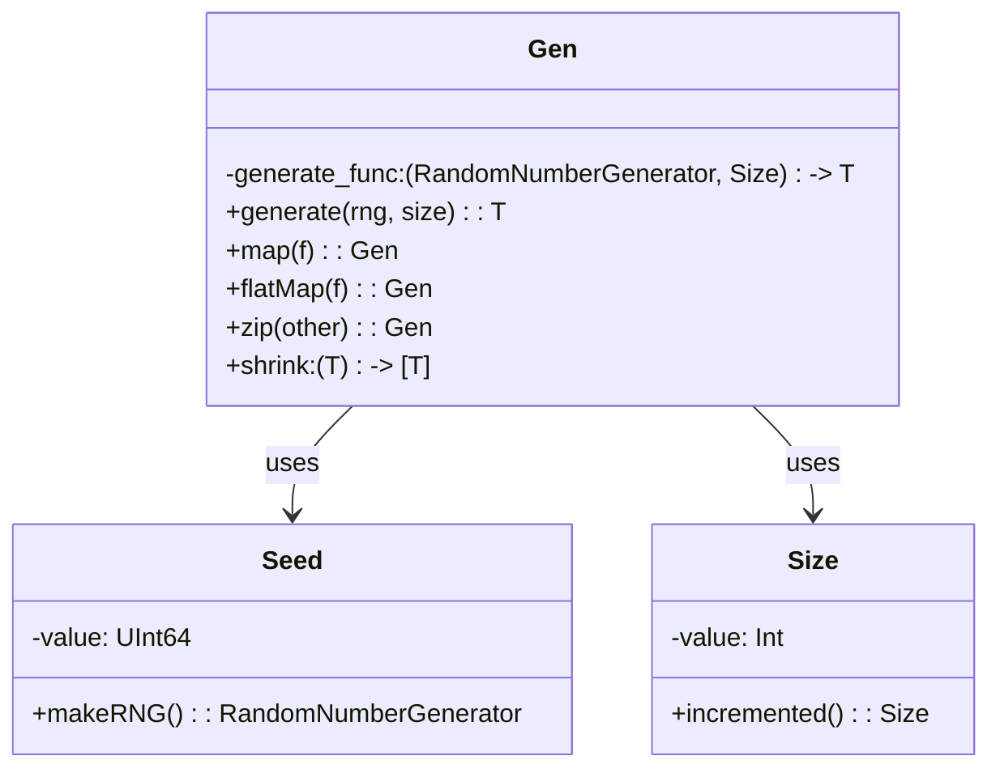
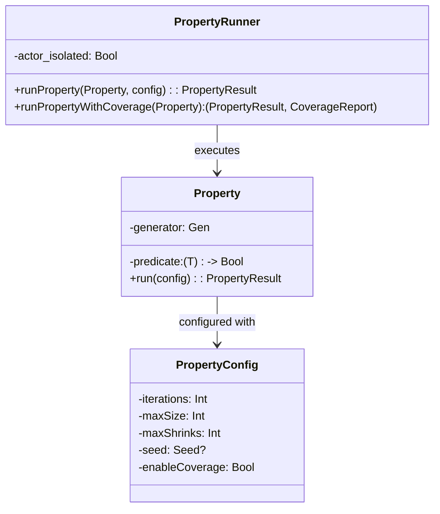
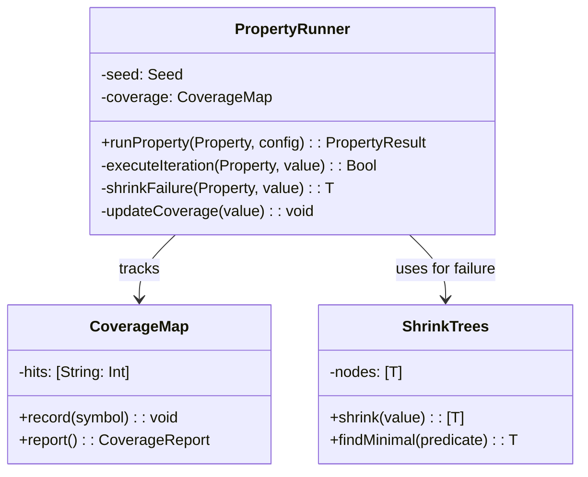
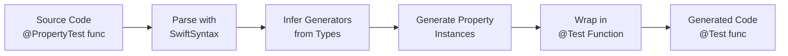
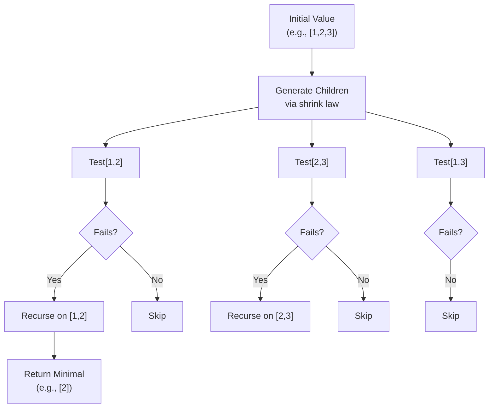

# Component Design

### 5.1 Component: Generator (Gen<T>)

#### 5.1.1 Responsibility

Generates random values of type `T` with configurable size and deterministic seeding. Implements functor, applicative, and monad laws for composable value generation.

#### 5.1.2 Interface

```swift
protocol Generator {
    associatedtype Value
    func generate(_ rng: inout RandomNumberGenerator, _ size: Size) -> Value
}

struct Gen<T>: Generator {
    func map<U>(_ f: (T) -> U) -> Gen<U>              // Functor
    func apply<U>(_ gf: Gen<(T) -> U>) -> Gen<U>      // Applicative
    func flatMap<U>(_ f: (T) -> Gen<U>) -> Gen<U>     // Monad
    func zip<U>(_ other: Gen<U>) -> Gen<(T, U)>       // Composition
    var shrink: (T) -> [T] { get }                    // Shrinking strategy
}
```

**Input**: RandomNumberGenerator, Size(0-100)
**Output**: Generated value of type T
**Side Effects**: Modifies RNG state (deterministic with seed)

#### 5.1.3 Internal Structure



#### 5.1.4 Dependencies

- `Seed`: Deterministic random number generation
- `Size`: Controls generation complexity
- `SwiftSyntax`: For macro-based generator derivation
- `Foundation.RandomNumberGenerator`: RNG protocol

#### 5.1.5 Error Handling

| Error Type | Handling Strategy | Recovery |
|------------|------------------|----------|
| Invalid Size | Clamp to valid range [0, 100] | Silently adjust |
| RNG Depletion | Reseed with deterministic strategy | Transparent to caller |
| Type Generation Failure | Return `nil` from optional generator | Caller handles absence |

---

### 5.2 Component: Property<T>

#### 5.2.1 Responsibility

Encapsulates a testable property: a predicate that should hold for all generated values. Tracks test configuration and execution results.

#### 5.2.2 Interface

```swift
struct Property<T> {
    let generator: Gen<T>
    let predicate: (T) -> Bool

    init(generator: Gen<T>, predicate: @escaping (T) -> Bool)
}

enum PropertyResult<T> {
    case success(iterations: Int)
    case failure(counterexample: T, iterations: Int, shrunk: T)
    case gaveUp(discarded: Int, iterations: Int)
}
```

**Input**: Generated values from generator
**Output**: PropertyResult indicating test outcome
**Side Effects**: Observes telemetry (coverage, iterations)

#### 5.2.3 Internal Structure



#### 5.2.4 Dependencies

- `Gen<T>`: Source of test values
- `PropertyConfig`: Execution configuration
- `Seed`: Deterministic test execution
- `TelemetrySystem`: Coverage and metric tracking

#### 5.2.5 Error Handling

| Error Type | Handling Strategy | Recovery |
|------------|------------------|----------|
| Predicate Exception | Catch and report as failure | Propagate stack trace |
| Timeout | Interrupt testing after threshold | Return partial result |
| Memory Pressure | Reduce generation size adaptively | Continue with smaller values |

---

### 5.3 Component: PropertyRunner

#### 5.3.1 Responsibility

Orchestrates property test execution, manages shrinking, handles coverage guidance, and provides test result reporting.

#### 5.3.2 Interface

```swift
actor PropertyRunner {
    nonisolated init(seed: Seed? = nil)

    func runProperty<T>(
        _ property: Property<T>,
        config: PropertyConfig
    ) async -> PropertyResult<T>

    func runPropertyWithCoverageTracking<T>(
        _ property: Property<T>,
        knownSymbols: [String]
    ) async -> (PropertyResult<T>, CoverageReport)
}
```

**Input**: Property, PropertyConfig
**Output**: PropertyResult with optional shrunk counterexample
**Side Effects**: Generates telemetry, updates coverage maps

#### 5.3.3 Internal Structure



#### 5.3.4 Dependencies

- `Property<T>`: Test case provider
- `ShrinkTrees`: Failure minimization
- `CoverageMap`: Coverage tracking
- `TelemetrySystem`: Metric reporting

#### 5.3.5 Error Handling

| Error Type | Handling Strategy | Recovery |
|------------|------------------|----------|
| All Tests Pass | Return success result | Standard path |
| First Failure at Iteration N | Attempt shrinking up to maxShrinks | Return shrunk counterexample |
| Too Many Discards | Abort before maxIterations reached | Return gaveUp result |
| Actor Isolation Violation | Compiler error at call site | Caller must use `await` |

---

### 5.4 Component: Macro System (@PropertyTest, @BusinessRule)

#### 5.4.1 Responsibility

Transform developer-friendly attribute syntax into compilable Swift Testing integration code. Generate appropriate generators, property instances, and test wrappers.

#### 5.4.2 Interface

```swift
@PropertyTest
func testExample(value: Int) { ... }

@BusinessRule("Discount should not exceed price")
func validateDiscount(price: Double, discount: Double) -> Bool { ... }
```

**Input**: Function declaration with attributes
**Output**: Generated `@Test` functions with Property integration
**Side Effects**: No side effects (compile-time transformation)

#### 5.4.3 Internal Structure



#### 5.4.4 Dependencies

- `SwiftCompilerPlugin`: Plugin infrastructure
- `SwiftSyntax`: AST manipulation
- `SwiftSyntaxBuilder`: Code generation
- `SwiftDiagnostics`: Compiler diagnostics

#### 5.4.5 Error Handling

| Error Type | Handling Strategy | Recovery |
|------------|------------------|----------|
| Non-function target | Emit compiler error | Halt expansion |
| Missing return type | Emit diagnostic | Suggest Bool return |
| Unsupported parameter type | Emit error suggesting smartGen | Halt expansion |
| Generator inference failure | Clear error message with suggestions | User adds custom generator |

---

### 5.5 Component: Shrinking Trees

#### 5.5.1 Responsibility

Minimize counterexamples to smallest failing cases through tree-based traversal of shrinking possibilities. Critical for usable error reporting.

#### 5.5.2 Interface

```swift
protocol Shrinkable {
    var shrink: Self { get }
    func shrinkTree() -> [Self]
}

struct ShrinkTrees {
    static func shrink<T>(_ value: T, predicate: (T) -> Bool) -> T
}
```

**Input**: Failing test value and predicate
**Output**: Minimal counterexample that still fails
**Side Effects**: Calls predicate repeatedly (cache results)

#### 5.5.3 Internal Structure



#### 5.4.4 Dependencies

- None (pure algorithm)

#### 5.4.5 Error Handling

| Error Type | Handling Strategy | Recovery |
|------------|------------------|----------|
| Infinite shrinking | Bound to maxShrinks | Return best found so far |
| Performance degradation | Cache predicate results | Transparent to caller |
| Non-monotonic predicates | Accept any value that fails | May not be minimal but correct |

---
