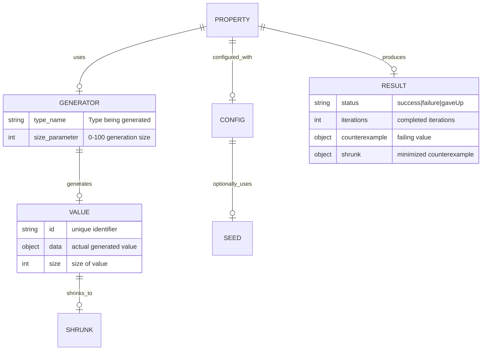

# Data Architecture

### 6.1 Data Models

### 6.2 Data Storage

| Data Type | Storage | Retention | Backup |
|-----------|---------|-----------|--------|
| Generated Values | In-memory (ephemeral) | Single test run | Not applicable |
| Coverage Maps | In-memory with file export | Per test session | Optional JSON export |
| Test Results | Struct instances | In-memory | Optional CI reporter integration |
| Seeds (Reproducible) | User-provided via Config | As specified in config | Version control (hardcoded in tests) |
| Telemetry Events | Streaming to TelemetrySystem | As configured | File-based if enabled |

### 6.3 Data Consistency

- **Consistency Model**: Strong (deterministic with seeding)
- **Transaction Boundaries**: Single property test execution is atomic
- **Conflict Resolution**: N/A (single-threaded within property, parallel across properties via actors)

### 6.4 Data Migration Strategy

InvariantSwift is a framework (not a persistent storage system), so data migration focuses on:

1. **API Evolution**: Backwards-compatible property interface
2. **Generator Evolution**: New generators added without breaking existing ones
3. **Config Evolution**: New fields added with sensible defaults
4. **Result Format**: Versioned PropertyResult enums

---
