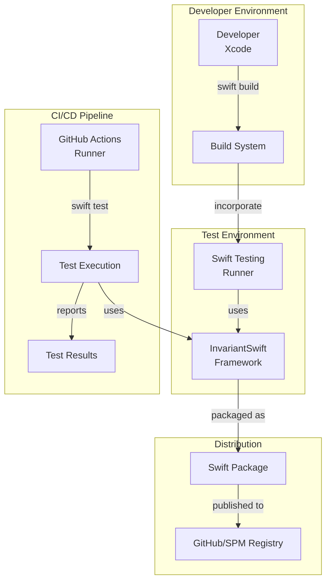

# Infrastructure

### 9.1 Deployment Architecture

InvariantSwift is a framework library, not a deployed service:

### 9.2 Environments

| Environment | Purpose | Where | Notes |
|-------------|---------|-------|-------|
| Local Dev | Developer testing | Developer machine | Swift 6.0+ required |
| CI Test | Automated testing | GitHub Actions | All platforms (iOS, macOS, Linux) |
| Release | Distribution | GitHub releases | Tagged commits |

### 9.3 Infrastructure as Code

- **Tool**: Swift Package Manager (Package.swift)
- **Repository**: InvariantSwift GitHub repository
- **Configuration**: Platform targets, dependencies, compiler flags

### 9.4 Scaling Strategy

Not applicable (framework library distributed via SPM)

### 9.5 Disaster Recovery

Not applicable (framework library)

---
