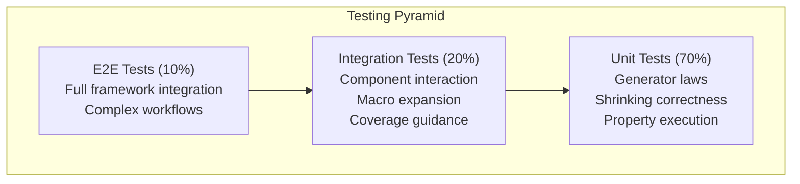

# Testing Strategy

### 13.1 Testing Pyramid

### 13.2 Unit Testing

- **Framework**: Swift Testing with `@Test`
- **Coverage Target**: 99%+
- **Conventions**: Test files in `Tests/FunctionalTesting/` organized by component
- **Scope**: Individual Gen implementations, Shrinking algorithms, Property predicates

### 13.3 Integration Testing

- **Framework**: Swift Testing with async support
- **Scope**: Generator composition, macro expansion, runner orchestration
- **Data**: Synthetic test data generated by framework itself (dogfooding)

### 13.4 End-to-End Testing

- **Framework**: Swift Testing with full property execution
- **Environments**: macOS, iOS Simulator, Linux (in CI)
- **Frequency**: Every commit (CI automated)

### 13.5 Test Automation

- **CI Integration**: GitHub Actions on every push
- **Quality Gates**:
  - All tests pass
  - Coverage ≥99% (enforced by coverage guard hook)
  - No compiler warnings
  - Linting passes (swift-sheriff)

---
