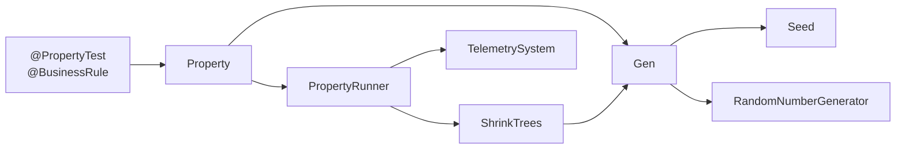
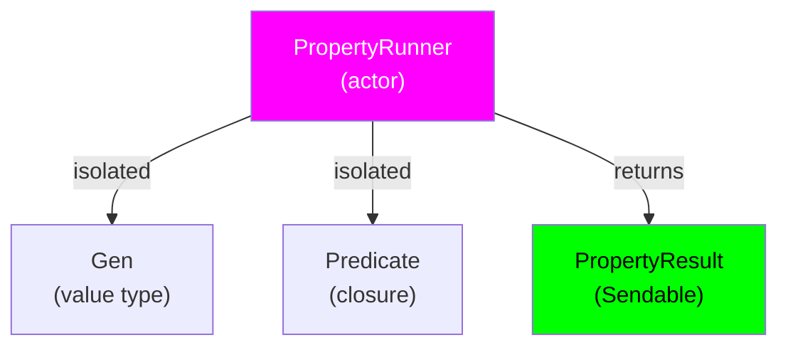

# Appendix

### 17.1 Glossary

| Term | Definition |
|------|------------|
| **Functor Law** | For a type `F<T>`, `F.map(id) == id` (identity) and `F.map(g ∘ f) == F.map(g) ∘ F.map(f)` (composition) |
| **Applicative** | Functor with `apply` method enabling composition of wrapped functions |
| **Monad** | Applicative with `flatMap` enabling sequential composition via bind (>>=) |
| **Shrinking** | Process of minimizing failing test case to smallest counterexample |
| **Property** | Predicate that should hold for all generated values |
| **Generator** | Function that produces random values of specified type |
| **Coverage Guidance** | Biasing test case generation toward unexplored code paths |
| **Model-Based Testing** | Testing stateful systems via command sequences against reference model |
| **Linearizability** | Concurrent operation histories appear as if executed sequentially |
| **Lens** | Composable accessor for nested data structure navigation |
| **Actor** | Swift 6 concurrency primitive ensuring thread-safe isolated access |
| **Sendable** | Swift 6 protocol indicating type safe for concurrent use |

### 17.2 References

- [Property-based Testing](https://en.wikipedia.org/wiki/Software_testing#Property_testing)
- [QuickCheck: A Lightweight Tool for Random Testing](https://dl.acm.org/doi/10.1145/351240.351266)
- [Shrinking and Showing Functions](https://dl.acm.org/doi/10.1145/2364527.2364529)
- [Category Theory for Programmers](https://bartoszmilewski.com/2014/10/28/category-theory-for-programmers-the-preface/)
- [Swift Concurrency Documentation](https://docs.swift.org/swift-book/documentation/the-swift-programming-language/concurrency)
- [SwiftSyntax Documentation](https://github.com/apple/swift-syntax)
- [Model-based Testing with Finite State Machines](https://en.wikipedia.org/wiki/Model-based_testing)

### 17.3 Related Documents

- [API Documentation](../docs/API.md)
- [User Guide](../docs/UserGuide.md)
- [Advanced Features](../docs/AdvancedFeatures.md)
- [Contributing Guide](../CONTRIBUTING.md)
- [CHANGELOG](../CHANGELOG.md)

### 17.4 Additional Diagrams

**Component Dependency Graph**:

**Swift 6 Strict Concurrency Model**:

---

**Document Sharding**: This document can be split at `---` separators into independent sections for distributed ownership and versioning. Each section can be independently version-controlled and assigned to domain experts.
