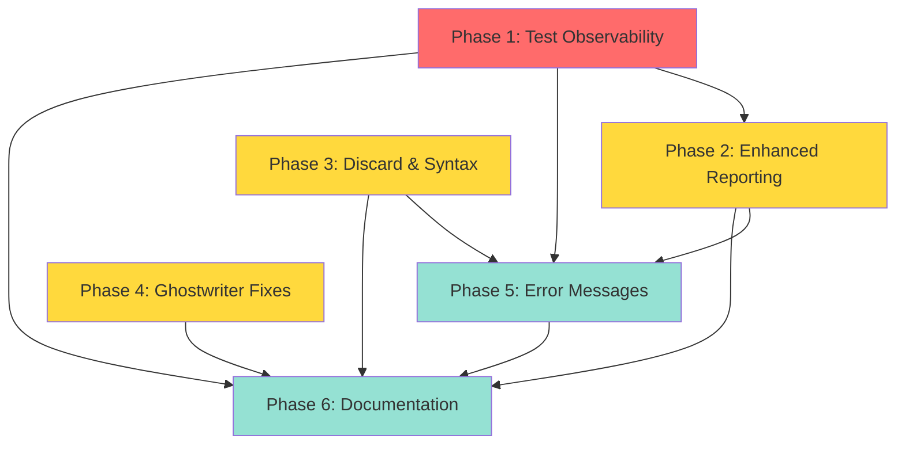

# InvariantSwift v2.0 Roadmap

**Project:** InvariantSwift v2.0 QuickCheck Feature Parity
**Created:** 2026-01-23
**Status:** Draft - Awaiting Approval
**Target:** 90%+ QuickCheck feature coverage with Swift-native ergonomics

---

## Executive Summary

InvariantSwift v2.0 closes the critical test observability gap that prevents developers from verifying their property tests exercise the right code paths. The framework currently sits at ~60% QuickCheck parity with strong foundations: generators with integrated shrinking, property testing infrastructure, macros, stateful testing, and example database. The missing 30% is concentrated in test observability (`cover`, `classify`, `collect`, `label`, `tabulate`) and developer experience improvements.

This roadmap delivers v2.0 in 6 phases over approximately 6-8 weeks of developer time. **Critical insight:** Most "missing" features are already implemented but not integrated. For example, `ClassificationContext`, `ClassificationReport`, and `ClassifyingProperty` exist but aren't wired to the standard `Property<T>` execution path. This means implementation is primarily integration work (30% new code, 70% wiring existing infrastructure).

The phasing prioritizes immediate value (P0: test observability) while building toward comprehensive QuickCheck parity (P1: enhanced reporting, syntax sugar) and polish (P2: error messages, documentation). All phases maintain 100% test coverage, use dogfood tests (property tests testing property testing), and preserve Swift 6 strict concurrency guarantees.

**Path Forward:**
1. **Phase 1 (P0):** Wire up existing `ClassificationContext` to enable `cover`, `classify`, `label` — 1-2 weeks
2. **Phase 2 (P1):** Add `collect`, `tabulate`, `counterexample` to complete QuickCheck reporting — 1-2 weeks
3. **Phase 3 (P1):** Implement `==>` operator and discard tracking — 3-5 days
4. **Phase 4 (P1):** Fix Ghostwriter (access filtering, auto-generate `@Arbitrary`) — 1 week
5. **Phase 5 (P2):** Polish error messages and progress indicators — 3-5 days
6. **Phase 6 (P2):** Documentation with XCTest migration guide and cookbook — 1 week

---

## Milestone Overview

| Phase | Name | Effort | Priority | Dependencies | Risk |
|-------|------|--------|----------|--------------|------|
| **1** | Test Observability | 1-2 weeks | **P0** | None | Low |
| **2** | Enhanced Reporting | 1-2 weeks | **P1** | Phase 1 | Low |
| **3** | Discard & Syntax Sugar | 3-5 days | **P1** | None | Low |
| **4** | Ghostwriter Fixes | 1 week | **P1** | None | Medium |
| **5** | Error Messages & Progress | 3-5 days | **P2** | Phases 1-3 | Low |
| **6** | Documentation & Examples | 1 week | **P2** | Phases 1-5 | Low |

**Total Estimated Effort:** 6-8 weeks developer time
**Parallelization Opportunities:** Phases 3 and 4 can run concurrently with Phases 1-2

---

## Phase 1: Test Observability

### Goal

Enable developers to verify their property tests exercise the right code paths by integrating QuickCheck's core observability features (`cover`, `classify`, `label`) into the standard property testing workflow.

### Priority: P0

**Justification:** Without test observability, developers cannot distinguish between comprehensive property tests and biased tests that only exercise a narrow slice of the input space. This is the critical blocker preventing v2.0 from achieving QuickCheck parity. Research (SUMMARY.md) identifies this as the #1 gap. Infrastructure already exists (`ClassificationContext`, `ClassificationReport`) but isn't integrated into `PropertyRunner`.

### Estimated Effort: 1-2 weeks

### Tasks

#### TASK-1.1: Extend Property<T> with Classification Builder API

**Deliverable:** Non-breaking API extensions that allow chaining `.cover()`, `.classify()`, `.label()` onto existing `Property<T>` instances.

**Files:**
- Modify: `Sources/InvariantSwift/Core/Property.swift`
- Create: `Sources/InvariantSwift/Core/Property+Classification.swift`

**Implementation:**
```swift
// Property+Classification.swift
extension Property {
  /// Enforce minimum coverage percentage for a condition
  public func cover(
    _ percentage: Double,
    when predicate: @escaping @Sendable (T) -> Bool,
    label: String
  ) -> ClassifyingProperty<T> {
    // Convert to ClassifyingProperty with coverage requirement
  }

  /// Label test cases matching a condition
  public func classify(
    when predicate: @escaping @Sendable (T) -> Bool,
    label: String
  ) -> ClassifyingProperty<T> {
    // Convert to ClassifyingProperty with classification
  }

  /// Unconditionally attach a label
  public func label(_ text: String) -> ClassifyingProperty<T> {
    // Convert to ClassifyingProperty with static label
  }
}
```

**Acceptance Criteria:**
- [ ] `Property<T>.cover()` returns `ClassifyingProperty<T>` with coverage requirement stored
- [ ] `Property<T>.classify()` returns `ClassifyingProperty<T>` with classification predicate stored
- [ ] `Property<T>.label()` returns `ClassifyingProperty<T>` with static label stored
- [ ] Multiple chained calls accumulate (e.g., `.cover(...).classify(...).label(...)`)
- [ ] API is 100% non-breaking (existing `Property<T>` tests unchanged)
- [ ] All public functions have full documentation comments

**Dependencies:** None

**Testing Requirements:**
- [ ] Unit test: Single `.cover()` call creates correct `ClassifyingProperty`
- [ ] Unit test: Multiple chained calls accumulate correctly
- [ ] Unit test: `.classify()` and `.label()` work independently
- [ ] Integration test: Chaining all three together
- [ ] Dogfood test: Property test verifying accumulation preserves order
- [ ] Macro test: `@PropertyTest` with `.cover()` compiles

---

#### TASK-1.2: Integrate ClassifyingProperty into PropertyRunner

**Deliverable:** Modify `PropertyRunner` to detect and execute `ClassifyingProperty<T>` instances with full classification tracking.

**Files:**
- Modify: `Sources/InvariantSwift/Testing/PropertyRunner.swift`
- Modify: `Sources/InvariantSwift/Core/ClassifyingPropertyRunner.swift`

**Implementation:**
```swift
// PropertyRunner.swift
public actor PropertyRunner {
  // Existing: checkProperty(_ property: Property<T>) async throws -> PropertyResult<T>

  // NEW: Detect ClassifyingProperty and route to classification runner
  public func checkProperty<T>(_ property: ClassifyingProperty<T>) async throws -> (PropertyResult<T>, ClassificationReport) {
    let context = ClassificationContext()

    for iteration in 0..<config.iterations {
      let value = property.generator.sample(seed: currentSeed, size: currentSize)

      guard property.assumption(value) else {
        // Track discard
        continue
      }

      context.recordIteration()
      let result = property.predicate(value, context)

      if !result {
        // Shrink and return failure
        break
      }
    }

    // Check coverage thresholds
    let report = context.report()
    let unmet = context.unmetCoverageThresholds()
    if !unmet.isEmpty {
      // Fail test with coverage violation
    }

    return (propertyResult, report)
  }
}
```

**Acceptance Criteria:**
- [ ] `PropertyRunner.checkProperty(ClassifyingProperty<T>)` executes with classification tracking
- [ ] Classification context accumulates labels and coverage checks during iteration loop
- [ ] Coverage thresholds are enforced after all iterations complete
- [ ] Test fails if coverage requirement unmet (with clear message)
- [ ] `ClassificationReport` returned alongside `PropertyResult<T>`
- [ ] Thread-safe accumulation (actor isolation verified)

**Dependencies:** TASK-1.1 (requires `Property+Classification` API)

**Testing Requirements:**
- [ ] Unit test: Classification context accumulates correctly
- [ ] Unit test: Coverage threshold enforcement works
- [ ] Unit test: Coverage failure message is clear
- [ ] Integration test: Full property test with `.cover()` and `.classify()`
- [ ] Integration test: Multiple coverage requirements all checked
- [ ] Dogfood test: Property test verifying PropertyRunner classification accumulation
- [ ] Performance test: Classification overhead < 10% vs baseline

---

#### TASK-1.3: Add Coverage Enforcement to PropertyConfig

**Deliverable:** Configuration options to control coverage behavior (enforce vs warn).

**Files:**
- Modify: `Sources/InvariantSwift/Testing/PropertyConfig.swift`
- Create: `Sources/InvariantSwift/Testing/CoverageConfig.swift`

**Implementation:**
```swift
// CoverageConfig.swift
public struct CoverageConfig: Sendable {
  /// Enforce coverage thresholds (fail test if unmet)
  public var enforceCoverage: Bool = true

  /// Warn (but don't fail) if coverage below threshold
  public var warnOnLowCoverage: Bool = true

  /// Maximum number of unique classification labels (prevents unbounded memory)
  public var maxLabels: Int = 1000
}

// PropertyConfig.swift
extension PropertyConfig {
  public var coverage: CoverageConfig = CoverageConfig()
}
```

**Acceptance Criteria:**
- [ ] `PropertyConfig.coverage.enforceCoverage` controls whether tests fail on unmet coverage
- [ ] Warning mode (`warnOnLowCoverage`) logs but doesn't fail
- [ ] `maxLabels` prevents unbounded label accumulation
- [ ] Default is `enforceCoverage = true` (strict by default)
- [ ] All configuration options documented

**Dependencies:** TASK-1.2 (PropertyRunner integration)

**Testing Requirements:**
- [ ] Unit test: `enforceCoverage = false` warns but passes
- [ ] Unit test: `enforceCoverage = true` fails on unmet coverage
- [ ] Unit test: `maxLabels` limit prevents unbounded growth
- [ ] Integration test: Override default config in property test
- [ ] Dogfood test: Property test for config behavior

---

#### TASK-1.4: Implement Dynamic Label Functions

**Deliverable:** Support for dynamic labeling based on input values, not just static strings.

**Files:**
- Modify: `Sources/InvariantSwift/Core/Property+Classification.swift`
- Modify: `Sources/InvariantSwift/Core/ClassificationContext.swift`

**Implementation:**
```swift
// Property+Classification.swift
extension Property {
  /// Dynamic labeling based on input value
  public func label(_ compute: @escaping @Sendable (T) -> String) -> ClassifyingProperty<T> {
    // Store closure that computes label from value
  }
}

// ClassificationContext.swift
extension ClassificationContext {
  /// Record a dynamic label for the current iteration
  public func label(_ text: String) {
    lock.lock()
    defer { lock.unlock() }

    labels["labels", default: [:]][text, default: 0] += 1
  }
}
```

**Acceptance Criteria:**
- [ ] `.label { value in "..." }` closure syntax works
- [ ] Dynamic labels computed per iteration
- [ ] Labels tracked in `ClassificationReport`
- [ ] Works with static `.label("...")` (both accumulate)
- [ ] Thread-safe label accumulation

**Dependencies:** TASK-1.1 (Property+Classification API)

**Testing Requirements:**
- [ ] Unit test: Dynamic label computation
- [ ] Unit test: Static and dynamic labels both tracked
- [ ] Integration test: `.label { ... }` in real property test
- [ ] Dogfood test: Property test for label accumulation

---

#### TASK-1.5: Implement ClassificationReport Pretty-Printing

**Deliverable:** Human-readable output of classification statistics in test results.

**Files:**
- Modify: `Sources/InvariantSwift/Core/ClassificationReport.swift`
- Modify: `Sources/InvariantSwift/Presentation/PrettyPrint.swift`

**Implementation:**
```swift
// ClassificationReport.swift
extension ClassificationReport {
  public func prettyPrint() -> String {
    var output = ""

    // Print label distributions
    for (category, stats) in labelDistribution.sorted(by: { $0.key < $1.key }) {
      output += "\n\(category):\n"
      for (label, labelStats) in stats.sorted(by: { $0.value.percentage > $1.value.percentage }) {
        output += "  \(String(format: "%5.1f%%", labelStats.percentage)) \(label)\n"
      }
    }

    // Print coverage results
    if !coverageResults.isEmpty {
      output += "\nCoverage:\n"
      for (name, result) in coverageResults.sorted(by: { $0.key < $1.key }) {
        let status = result.met ? "✓" : "✗"
        output += "  \(status) \(name): \(String(format: "%.1f%%", result.percentage)) (required: \(String(format: "%.1f%%", result.threshold)))\n"
      }
    }

    return output
  }
}
```

**Acceptance Criteria:**
- [ ] Classification labels sorted by percentage (highest first)
- [ ] Coverage results show ✓ or ✗ status
- [ ] Output format matches QuickCheck style
- [ ] Empty reports produce no output (silent when unused)
- [ ] Multi-category reports clearly separated

**Dependencies:** None (extends existing `ClassificationReport`)

**Testing Requirements:**
- [ ] Unit test: Label formatting correct
- [ ] Unit test: Coverage formatting correct
- [ ] Unit test: Empty report produces empty string
- [ ] Unit test: Multi-category reports formatted correctly
- [ ] Integration test: Pretty-print output in real property test failure
- [ ] Snapshot test: Exact output format matches expected

---

#### TASK-1.6: Wire Classification to Swift Testing Integration

**Deliverable:** Make classification reports visible in Swift Testing output.

**Files:**
- Modify: `Sources/InvariantSwift/SwiftTesting/PropertyTestIntegration.swift`
- Modify: `Sources/InvariantSwift/SwiftTesting/FailureReporting.swift`

**Implementation:**
```swift
// PropertyTestIntegration.swift
public func checkProperty<T>(_ property: ClassifyingProperty<T>) async throws {
  let runner = PropertyRunner()
  let (result, report) = try await runner.checkProperty(property)

  switch result {
  case .success:
    // Attach classification report as comment
    Issue.record(Comment(rawValue: report.prettyPrint()))

  case .failure(let counterexample, _, _):
    // Include classification in failure message
    Issue.record("\(report.prettyPrint())\n\nCounterexample: \(counterexample)")
  }
}
```

**Acceptance Criteria:**
- [ ] Classification report appears in Swift Testing output
- [ ] Report shown for both passing and failing tests
- [ ] Coverage failures produce clear error messages
- [ ] Integration with existing `@PropertyTest` macro works
- [ ] Works in Xcode Test Navigator

**Dependencies:** TASK-1.2 (PropertyRunner integration), TASK-1.5 (pretty-printing)

**Testing Requirements:**
- [ ] Integration test: `@PropertyTest` with `.cover()` shows report
- [ ] Integration test: Coverage failure appears in Swift Testing output
- [ ] CI test: Verify output in CI logs
- [ ] Macro test: `@PropertyTest` expansion includes classification

---

#### TASK-1.7: Add Classification Examples to Tests

**Deliverable:** Comprehensive test suite demonstrating all classification features.

**Files:**
- Create: `Tests/FunctionalTesting/ClassificationTests.swift`
- Create: `Tests/FunctionalTesting/CoverageEnforcementTests.swift`
- Create: `Tests/FunctionalTesting/LabelDistributionTests.swift`

**Implementation:**
```swift
// ClassificationTests.swift
@Suite("Classification Tests")
struct ClassificationTests {

  @Test("Single classify() labels test cases")
  func singleClassification() async throws {
    let property = Property(generator: Gen<Int>.int(in: -100...100))
      .classify(when: { $0 > 0 }, label: "positive")
      .classify(when: { $0 < 0 }, label: "negative")
      .classify(when: { $0 == 0 }, label: "zero")

    let (result, report) = try await PropertyRunner().checkProperty(property)

    #expect(result.isSuccess)
    #expect(report.labelDistribution["sign"]?.keys.contains("positive") == true)
  }

  @Test("cover() enforces minimum percentage")
  func coverageEnforcement() async throws {
    let property = Property(generator: Gen<Int>.int(in: 0...100))
      .cover(50, when: { $0 > 50 }, label: "large")

    // Should pass because ~50% of 0...100 are > 50
    let (result, _) = try await PropertyRunner().checkProperty(property)
    #expect(result.isSuccess)
  }

  @Test("Dogfood: Classification accumulates correctly")
  @PropertyTest(iterations: 100)
  func classificationAccumulation(n: Int) {
    // Use property test to verify classification accumulation
    let context = ClassificationContext()
    for _ in 0..<10 {
      context.classify("test", n > 0 ? "positive" : "negative")
    }
    let report = context.report()
    #expect(report.labelDistribution["test"]?.count == 1) // Only one label per run
  }
}
```

**Acceptance Criteria:**
- [ ] Tests demonstrate single and multiple classifications
- [ ] Tests demonstrate coverage enforcement (pass and fail cases)
- [ ] Tests demonstrate dynamic labeling
- [ ] Dogfood tests use property testing to verify classification
- [ ] All tests achieve 100% line coverage
- [ ] All tests pass

**Dependencies:** All previous Phase 1 tasks

**Testing Requirements:**
- [ ] 15+ tests covering all classification scenarios
- [ ] 3+ dogfood tests using property testing
- [ ] Integration tests with `@PropertyTest` macro
- [ ] Edge case tests (empty distributions, 100% coverage, etc.)

---

### Success Criteria

- [ ] All Phase 1 tasks complete
- [ ] `Property<T>.cover()`, `.classify()`, `.label()` APIs implemented
- [ ] `PropertyRunner` executes `ClassifyingProperty<T>` with full tracking
- [ ] Coverage thresholds enforced (configurable)
- [ ] Classification reports pretty-printed in test output
- [ ] Swift Testing integration shows reports
- [ ] 100% test coverage for new code (line and branch)
- [ ] 3+ dogfood tests (property tests testing classification)
- [ ] All tests pass with zero warnings
- [ ] Performance overhead < 10% vs baseline property tests

### Risk Factors

**Risk:** Actor isolation conflicts between `PropertyRunner` and `ClassificationContext`
**Mitigation:** Use `@unchecked Sendable` for `ClassificationContext` with internal locking (already implemented)

**Risk:** Classification overhead exceeds 10% performance budget
**Mitigation:** Add benchmarks in TASK-1.2, optimize hot paths if needed

**Risk:** Breaking changes to existing `Property<T>` API
**Mitigation:** All extensions return `ClassifyingProperty<T>`, not mutate `Property<T>`

---

## Phase 2: Enhanced Reporting

### Goal

Complete QuickCheck reporting parity by adding value collection (`collect`), multi-dimensional tabulation (`tabulate`), and custom failure messages (`counterexample`).

### Priority: P1

**Justification:** These features enhance debugging workflow and test quality verification. `collect` helps verify generator diversity, `tabulate` tracks multi-dimensional distributions, and `counterexample` makes failures actionable. All build on Phase 1's `ClassificationContext` infrastructure.

### Estimated Effort: 1-2 weeks

### Tasks

#### TASK-2.1: Implement Value Collection (collect)

**Deliverable:** Collect and histogram arbitrary values extracted from test inputs.

**Files:**
- Modify: `Sources/InvariantSwift/Core/Property+Classification.swift`
- Modify: `Sources/InvariantSwift/Core/ClassificationContext.swift`
- Modify: `Sources/InvariantSwift/Core/ClassificationReport.swift`

**Implementation:**
```swift
// Property+Classification.swift
extension Property {
  public func collect<U: Hashable & CustomStringConvertible>(
    _ extract: @escaping @Sendable (T) -> U
  ) -> ClassifyingProperty<T> {
    // Convert to ClassifyingProperty with value collection
  }
}

// ClassificationContext.swift
extension ClassificationContext {
  public func collect<U: Hashable>(_ value: U, category: String = "collected") {
    lock.lock()
    defer { lock.unlock() }

    let key = String(describing: value)
    labels[category, default: [:]][key, default: 0] += 1
  }
}
```

**Acceptance Criteria:**
- [ ] `.collect { value in ... }` extracts and tracks values
- [ ] Histogram shows frequency distribution
- [ ] Works with any `Hashable & CustomStringConvertible` type
- [ ] Numeric values automatically bucketed for readability
- [ ] Thread-safe value accumulation

**Dependencies:** Phase 1 (TASK-1.2 for ClassificationContext integration)

**Testing Requirements:**
- [ ] Unit test: Value collection and histogram
- [ ] Unit test: Numeric bucketing algorithm
- [ ] Integration test: `.collect()` in real property test
- [ ] Dogfood test: Property test for histogram accuracy
- [ ] Performance test: Collection overhead < 5%

---

#### TASK-2.2: Implement Multi-Dimensional Tabulation

**Deliverable:** Track multiple independent classification categories simultaneously.

**Files:**
- Modify: `Sources/InvariantSwift/Core/Property+Classification.swift`
- Modify: `Sources/InvariantSwift/Core/ClassificationContext.swift`

**Implementation:**
```swift
// Property+Classification.swift
extension Property {
  public func tabulate(
    _ category: String,
    labels: @escaping @Sendable (T) -> [String]
  ) -> ClassifyingProperty<T> {
    // Convert to ClassifyingProperty with multi-label tabulation
  }
}
```

**Acceptance Criteria:**
- [ ] `.tabulate(category, labels: { ... })` tracks multiple labels per input
- [ ] Categories tracked independently
- [ ] Labels can overlap within a category
- [ ] Pretty-printed as separate tables
- [ ] Integrates with existing classification

**Dependencies:** Phase 1 (TASK-1.5 for ClassificationReport)

**Testing Requirements:**
- [ ] Unit test: Multiple categories tracked independently
- [ ] Unit test: Overlapping labels within category
- [ ] Integration test: Tabulate with classify together
- [ ] Dogfood test: Property test for tabulation correctness

---

#### TASK-2.3: Implement Counterexample Messages

**Deliverable:** Allow custom explanatory messages for failures.

**Files:**
- Modify: `Sources/InvariantSwift/Core/Property+Classification.swift`
- Modify: `Sources/InvariantSwift/Core/PropertyResult.swift`
- Modify: `Sources/InvariantSwift/Presentation/PrettyPrint.swift`

**Implementation:**
```swift
// Property+Classification.swift
extension Property {
  public func counterexample(
    _ message: @escaping @Sendable (T) -> String
  ) -> ClassifyingProperty<T> {
    // Store message closure for failure rendering
  }
}

// PropertyResult.swift
extension PropertyResult {
  case failure(
    counterexample: T,
    shrinkSteps: Int,
    reason: FailureReason,
    customMessage: String? = nil  // NEW
  )
}
```

**Acceptance Criteria:**
- [ ] `.counterexample { value in "..." }` stores custom message
- [ ] Message computed only for failures (lazy evaluation)
- [ ] Multiple counterexample calls accumulate
- [ ] Messages appear in failure reports
- [ ] Zero overhead for passing tests

**Dependencies:** Phase 1 (TASK-1.6 for failure reporting)

**Testing Requirements:**
- [ ] Unit test: Message computation on failure
- [ ] Unit test: Multiple messages accumulate
- [ ] Integration test: Counterexample message in failure output
- [ ] Performance test: No overhead for passing tests

---

#### TASK-2.4: Enhance ClassificationReport Formatting

**Deliverable:** Pretty-printed tables for `collect` and `tabulate` output.

**Files:**
- Modify: `Sources/InvariantSwift/Core/ClassificationReport.swift`
- Modify: `Sources/InvariantSwift/Presentation/PrettyPrint.swift`

**Implementation:**
```swift
// ClassificationReport.swift
extension ClassificationReport {
  func formatHistogram(_ category: String, _ stats: [String: LabelStats]) -> String {
    // Bucket numeric values
    // Sort by frequency
    // Format as ASCII table
  }

  func formatTable(_ category: String, _ labels: [String: LabelStats]) -> String {
    // Format multi-dimensional table
  }
}
```

**Acceptance Criteria:**
- [ ] Histograms show value buckets for numeric data
- [ ] Tables formatted with aligned columns
- [ ] QuickCheck-style output format
- [ ] Color coding for coverage (✓/✗)
- [ ] Works in terminal and CI/CD

**Dependencies:** TASK-2.1, TASK-2.2 (collect and tabulate implementation)

**Testing Requirements:**
- [ ] Unit test: Histogram formatting
- [ ] Unit test: Table formatting
- [ ] Snapshot test: Exact output format
- [ ] CI test: Verify output in CI logs

---

#### TASK-2.5: Add Comprehensive Reporting Tests

**Deliverable:** Test suite demonstrating all reporting features.

**Files:**
- Create: `Tests/FunctionalTesting/CollectTests.swift`
- Create: `Tests/FunctionalTesting/TabulateTests.swift`
- Create: `Tests/FunctionalTesting/CounterexampleTests.swift`

**Implementation:**
```swift
// CollectTests.swift
@Suite("Value Collection Tests")
struct CollectTests {

  @Test("collect() histograms array lengths")
  func arrayLengthHistogram() async throws {
    let property = Property(generator: Gen<[Int]>.array(Gen.int, count: 0...20))
      .collect { $0.count }

    let (_, report) = try await PropertyRunner().checkProperty(property)

    // Verify histogram contains diverse lengths
    #expect(report.labelDistribution["collected"]?.count ?? 0 > 5)
  }

  @Test("Dogfood: Histogram accuracy")
  @PropertyTest
  func histogramAccuracy(values: [Int]) {
    let context = ClassificationContext()
    for value in values {
      context.collect(value)
    }
    let report = context.report()

    // Histogram count should match input count
    let total = report.labelDistribution["collected"]?.values.reduce(0) { $0 + $1.count }
    #expect(total == values.count)
  }
}
```

**Acceptance Criteria:**
- [ ] Tests demonstrate `collect()` with diverse types
- [ ] Tests demonstrate `tabulate()` with multiple categories
- [ ] Tests demonstrate `counterexample()` messages
- [ ] Dogfood tests verify reporting correctness
- [ ] 100% line coverage for new code

**Dependencies:** All previous Phase 2 tasks

**Testing Requirements:**
- [ ] 10+ tests covering all reporting scenarios
- [ ] 2+ dogfood tests
- [ ] Integration tests with all Phase 1 features
- [ ] Edge case tests

---

### Success Criteria

- [ ] All Phase 2 tasks complete
- [ ] `collect`, `tabulate`, `counterexample` APIs implemented
- [ ] Pretty-printed histograms and tables in test output
- [ ] Custom failure messages displayed
- [ ] 100% test coverage for new code
- [ ] 2+ dogfood tests
- [ ] Performance overhead < 5% for collection
- [ ] All tests pass with zero warnings

### Risk Factors

**Risk:** Histogram bucketing algorithm produces poor groupings
**Mitigation:** Test with diverse data ranges, allow manual bucket specification

**Risk:** Multi-dimensional tables too verbose
**Mitigation:** Limit default output, provide verbose flag

---

## Phase 3: Discard & Syntax Sugar

### Goal

Complete QuickCheck ergonomics with `==>` implication operator and discard ratio tracking.

### Priority: P1

**Justification:** Small DX improvements that complete QuickCheck syntax parity. Discard tracking prevents over-filtering pitfall (Pitfall 4 in research). Syntax sugar makes conditional properties readable.

### Estimated Effort: 3-5 days

### Tasks

#### TASK-3.1: Implement ==> Implication Operator

**Deliverable:** QuickCheck-style conditional property syntax.

**Files:**
- Create: `Sources/InvariantSwift/Core/ImplicationOperator.swift`
- Modify: `Sources/InvariantSwift/Core/Property.swift`

**Implementation:**
```swift
// ImplicationOperator.swift
infix operator ==> : ComparisonPrecedence

extension Bool {
  public static func ==> (
    precondition: Bool,
    consequent: @autoclosure () -> Bool
  ) -> PropertyEvaluation {
    if !precondition {
      return .discard(reason: "precondition false")
    }
    return consequent() ? .pass : .fail(reason: nil)
  }
}
```

**Acceptance Criteria:**
- [ ] `precondition ==> consequent` syntax works
- [ ] Short-circuits consequent if precondition false
- [ ] Returns `.discard` for false preconditions
- [ ] Works with existing `PropertyEvaluation` infrastructure
- [ ] Operator precedence correct

**Dependencies:** None (extends existing `PropertyEvaluation`)

**Testing Requirements:**
- [ ] Unit test: Operator precedence
- [ ] Unit test: Short-circuit evaluation
- [ ] Integration test: `==>` in property test
- [ ] Macro test: `@PropertyTest` with `==>` compiles

---

#### TASK-3.2: Add Discard Ratio Tracking

**Deliverable:** Track and report discard ratios with warnings.

**Files:**
- Modify: `Sources/InvariantSwift/Testing/PropertyConfig.swift`
- Modify: `Sources/InvariantSwift/Testing/PropertyRunner.swift`
- Modify: `Sources/InvariantSwift/Core/PropertyResult.swift`

**Implementation:**
```swift
// PropertyConfig.swift
extension PropertyConfig {
  public var warnDiscardRatio: Double = 5.0
  public var maxDiscardRatio: Double = 10.0
}

// PropertyResult.swift
extension PropertyResult {
  case gaveUp(
    discards: Int,
    iterations: Int,
    discardReasons: [String: Int]
  )
}

// PropertyRunner.swift
extension PropertyRunner {
  func checkDiscardRatio(discards: Int, iterations: Int) throws {
    let ratio = Double(discards) / Double(iterations)
    if ratio > config.maxDiscardRatio {
      throw PropertyError.gaveUp(discards: discards, iterations: iterations)
    } else if ratio > config.warnDiscardRatio {
      // Log warning
    }
  }
}
```

**Acceptance Criteria:**
- [ ] Discard ratio calculated correctly
- [ ] Warning at 5x discards (configurable)
- [ ] Failure at 10x discards (configurable)
- [ ] Discard reasons tracked with frequencies
- [ ] Clear error messages with suggestions

**Dependencies:** None

**Testing Requirements:**
- [ ] Unit test: Discard ratio calculation
- [ ] Unit test: Warning threshold triggers
- [ ] Unit test: Failure threshold triggers
- [ ] Integration test: Discard with `==>`
- [ ] Dogfood test: Property test for discard tracking

---

#### TASK-3.3: Enhance Discard Error Messages

**Deliverable:** Actionable suggestions for fixing over-filtering.

**Files:**
- Modify: `Sources/InvariantSwift/Presentation/PrettyPrint.swift`
- Create: `Sources/InvariantSwift/Testing/DiscardSuggestions.swift`

**Implementation:**
```swift
// DiscardSuggestions.swift
func suggestGeneratorFix(discardReasons: [String: Int]) -> String {
  """
  High discard ratio detected. Redesign generator to produce valid inputs directly.

  Instead of:  Gen.int.filter { $0 > 0 }
  Try:         Gen.int(in: 1...Int.max)

  Discard reasons:
  \(discardReasons.sorted { $0.value > $1.value }.map { "  - \($0.key): \($0.value) times" }.joined(separator: "\n"))
  """
}
```

**Acceptance Criteria:**
- [ ] Error messages show top discard reasons
- [ ] Suggestions include generator alternatives
- [ ] Clear before/after examples
- [ ] Links to documentation

**Dependencies:** TASK-3.2 (discard tracking)

**Testing Requirements:**
- [ ] Unit test: Suggestion generation
- [ ] Integration test: Error message formatting
- [ ] CI test: Verify suggestions in output

---

#### TASK-3.4: Add Discard Tests

**Deliverable:** Comprehensive test suite for discard tracking.

**Files:**
- Create: `Tests/FunctionalTesting/DiscardTrackingTests.swift`
- Create: `Tests/FunctionalTesting/ImplicationOperatorTests.swift`

**Acceptance Criteria:**
- [ ] Tests demonstrate `==>` operator
- [ ] Tests demonstrate discard tracking
- [ ] Tests demonstrate warning/failure thresholds
- [ ] Dogfood tests verify discard ratio calculation
- [ ] 100% line coverage

**Dependencies:** All previous Phase 3 tasks

**Testing Requirements:**
- [ ] 8+ tests covering discard scenarios
- [ ] 2+ dogfood tests
- [ ] Integration tests with Phase 1-2 features

---

### Success Criteria

- [ ] All Phase 3 tasks complete
- [ ] `==>` operator implemented and working
- [ ] Discard ratio tracked and reported
- [ ] Warnings and failures on excessive discards
- [ ] 100% test coverage for new code
- [ ] 2+ dogfood tests
- [ ] All tests pass with zero warnings

### Risk Factors

**Risk:** `==>` operator conflicts with existing Swift operators
**Mitigation:** Use explicit precedence group, test with complex expressions

**Risk:** Discard ratio thresholds too strict
**Mitigation:** Make configurable, default to QuickCheck values (10x)

---

## Phase 4: Ghostwriter Fixes

### Goal

Make Ghostwriter production-ready by fixing access level filtering, auto-generating missing `@Arbitrary`, and compile-testing output.

### Priority: P1

**Justification:** Ghostwriter is a differentiator (only Hypothesis has this), but current implementation generates broken tests. Fixing makes it usable for real projects.

### Estimated Effort: 1 week

### Tasks

#### TASK-4.1: Implement Access Level Filtering

**Deliverable:** Extract access levels from SwiftSyntax AST, filter to public/open only.

**Files:**
- Modify: `Sources/InvariantSwift/Ghostwriter/TypeInfo.swift`
- Modify: `Sources/InvariantSwift/Ghostwriter/SourceAnalyzer.swift`

**Implementation:**
```swift
// TypeInfo.swift
public struct TypeInfo: Sendable {
  public let name: String
  public let accessLevel: AccessLevel  // NEW
  public let members: [MemberInfo]
  // ...
}

public enum AccessLevel: String, Sendable {
  case `private`
  case `fileprivate`
  case `internal`
  case `public`
  case `open`

  var isPublic: Bool {
    self == .public || self == .open
  }
}

// SourceAnalyzer.swift
extension SourceAnalyzer {
  func extractAccessLevel(from decl: DeclSyntax) -> AccessLevel {
    // Parse modifiers to find access level
    // Default to internal if not specified
  }
}
```

**Acceptance Criteria:**
- [ ] Access level extracted from all type declarations
- [ ] Default to `internal` if not specified
- [ ] Filter types by access level before test generation
- [ ] `--include-internal` flag to override
- [ ] Verbose logging for skipped types

**Dependencies:** None (isolated to Ghostwriter)

**Testing Requirements:**
- [ ] Unit test: Access level extraction
- [ ] Unit test: Private types skipped
- [ ] Unit test: Public types included
- [ ] Integration test: `--include-internal` flag
- [ ] Macro test: Generated tests compile

---

#### TASK-4.2: Auto-Generate Missing @Arbitrary

**Deliverable:** Detect types without generators, generate `@Arbitrary` extensions automatically.

**Files:**
- Modify: `Sources/InvariantSwift/Ghostwriter/TestGenerator.swift`
- Create: `Sources/InvariantSwift/Ghostwriter/ArbitraryGenerator.swift`

**Implementation:**
```swift
// ArbitraryGenerator.swift
struct ArbitraryGenerator {
  func generateArbitrary(for type: TypeInfo) -> String? {
    guard canGenerateArbitrary(for: type) else { return nil }

    // Generate: extension TypeName: Arbitrary { static var arbitrary: Gen<TypeName> { ... } }
    return """
    extension \(type.name) {
      public static var arbitrary: Gen<\(type.name)> {
        \(generateGeneratorBody(for: type))
      }
    }
    """
  }

  private func canGenerateArbitrary(for type: TypeInfo) -> Bool {
    // Check if all members have generators
    // Skip classes, protocols, enums (for now)
  }

  private func generateGeneratorBody(for type: TypeInfo) -> String {
    // Use Gen.zip(...).map { TypeName(...) }
  }
}
```

**Acceptance Criteria:**
- [ ] Generates valid `@Arbitrary` for structs with 1-10 members
- [ ] Handles nested types and optionals
- [ ] Warns for unsupported types (classes, protocols)
- [ ] Generated code compiles without errors
- [ ] `--generate-arbitrary` flag to enable/disable

**Dependencies:** TASK-4.1 (access level filtering)

**Testing Requirements:**
- [ ] Unit test: Simple struct generation
- [ ] Unit test: Nested type generation
- [ ] Unit test: Generic type generation
- [ ] Integration test: Generated tests compile
- [ ] Dogfood test: Property test for generator validity

---

#### TASK-4.3: Implement Compile-Test Infrastructure

**Deliverable:** Verify generated tests compile before writing to disk.

**Files:**
- Modify: `Sources/InvariantSwift/Ghostwriter/TestGenerator.swift`
- Create: `Sources/InvariantSwift/Ghostwriter/CompilationValidator.swift`

**Implementation:**
```swift
// CompilationValidator.swift
struct CompilationValidator {
  func validate(_ code: String, target: String) throws {
    let tempFile = FileManager.default.temporaryDirectory
      .appendingPathComponent("ghostwriter_\(UUID().uuidString).swift")

    try code.write(to: tempFile, atomically: true, encoding: .utf8)
    defer { try? FileManager.default.removeItem(at: tempFile) }

    let process = Process()
    process.executableURL = URL(fileURLWithPath: "/usr/bin/swift")
    process.arguments = ["build", "--target", target, tempFile.path]

    try process.run()
    process.waitUntilExit()

    guard process.terminationStatus == 0 else {
      throw CompilationError.failed
    }
  }
}
```

**Acceptance Criteria:**
- [ ] All generated tests compile before writing
- [ ] Clear error messages for compilation failures
- [ ] `--skip-compile-test` flag for speed
- [ ] Works in CI/CD environments

**Dependencies:** TASK-4.2 (arbitrary generation)

**Testing Requirements:**
- [ ] Unit test: Compilation success
- [ ] Unit test: Compilation failure handling
- [ ] Integration test: Full Ghostwriter pipeline
- [ ] CI test: Ghostwriter on sample projects

---

#### TASK-4.4: Add Ghostwriter Tests

**Deliverable:** Test suite for all Ghostwriter fixes.

**Files:**
- Create: `Tests/FunctionalTesting/GhostwriterAccessLevelTests.swift`
- Create: `Tests/FunctionalTesting/GhostwriterArbitraryGenerationTests.swift`
- Create: `Tests/FunctionalTesting/GhostwriterCompilationTests.swift`

**Acceptance Criteria:**
- [ ] Tests verify access level filtering
- [ ] Tests verify arbitrary generation
- [ ] Tests verify compilation validation
- [ ] Integration tests with real project structures
- [ ] 100% line coverage

**Dependencies:** All previous Phase 4 tasks

**Testing Requirements:**
- [ ] 12+ tests covering Ghostwriter scenarios
- [ ] 2+ dogfood tests
- [ ] CI integration tests

---

### Success Criteria

- [ ] All Phase 4 tasks complete
- [ ] Access level filtering works
- [ ] Auto-generation of `@Arbitrary` works
- [ ] Compile-test infrastructure works
- [ ] Ghostwriter generates compilable tests
- [ ] 100% test coverage for new code
- [ ] 2+ dogfood tests
- [ ] All tests pass with zero warnings

### Risk Factors

**Risk:** Generic type inference too complex
**Mitigation:** Start simple (non-generic structs), expand incrementally

**Risk:** Compile-test slow in CI/CD
**Mitigation:** Add `--skip-compile-test` flag, cache results

**Risk:** Auto-generated arbitrary incorrect for complex types
**Mitigation:** Warn and skip instead of generating broken code

---

## Phase 5: Error Messages & Progress

### Goal

Polish developer experience with enhanced failure messages and progress indicators.

### Priority: P2

**Justification:** Quality-of-life improvements that make debugging faster. Not blocking v2.0 but high value.

### Estimated Effort: 3-5 days

### Tasks

#### TASK-5.1: Enhanced Failure Messages

**Deliverable:** Comprehensive failure messages with reproduction commands.

**Files:**
- Modify: `Sources/InvariantSwift/Presentation/PrettyPrint.swift`
- Modify: `Sources/InvariantSwift/SwiftTesting/FailureReporting.swift`

**Implementation:**
```swift
// PrettyPrint.swift
extension PropertyResult {
  func formatFailureMessage() -> String {
    """
    ❌ Property test failed

    Test: \(testName)
    Property: \(propertyDescription)

    Counterexample (minimal after \(shrinkSteps) shrinks):
      \(prettyPrint(counterexample))

    Reproduce with:
      swift test --filter \(testName)
      OR
      @PropertyTest(seed: \(seed), iterations: 1)

    Original failure:
      \(prettyPrint(originalFailure))

    Shrinking path: \(originalSize) → \(minimalSize) (\(reductionPercentage)% reduction)
    Time: \(elapsedTime)s (\(shrinkAttempts) shrink attempts)
    """
  }
}
```

**Acceptance Criteria:**
- [ ] All failure info in single message
- [ ] Reproduction command copy-pasteable
- [ ] Shrinking metrics informative
- [ ] Works with Swift Testing output

**Dependencies:** Phases 1-3 (new features to document)

**Testing Requirements:**
- [ ] Unit test: Message formatting
- [ ] Integration test: Reproduction command works
- [ ] Dogfood test: Property test for message correctness

---

#### TASK-5.2: Progress Indicators

**Deliverable:** Progress updates for long-running tests.

**Files:**
- Modify: `Sources/InvariantSwift/Testing/PropertyRunner.swift`
- Modify: `Sources/InvariantSwift/Testing/PropertyConfig.swift`

**Implementation:**
```swift
// PropertyConfig.swift
extension PropertyConfig {
  public var showProgress: Bool = false
  public var progressInterval: TimeInterval = 5.0
}

// PropertyRunner.swift
extension PropertyRunner {
  func logProgress(iteration: Int, total: Int, elapsed: TimeInterval, rate: Double) {
    guard config.showProgress else { return }
    print("Running \(testName): \(iteration)/\(total) tests (\(elapsed)s, \(rate) tests/sec)")
  }
}
```

**Acceptance Criteria:**
- [ ] Progress shown every 5 seconds or 1000 iterations
- [ ] Silent for fast tests (< 5 seconds)
- [ ] Works in CI/CD (no TTY required)
- [ ] Configurable thresholds

**Dependencies:** None

**Testing Requirements:**
- [ ] Unit test: Progress calculation
- [ ] Integration test: Progress output
- [ ] CI test: No progress for fast tests

---

#### TASK-5.3: Seed Logging

**Deliverable:** Log seeds for reproducibility.

**Files:**
- Modify: `Sources/InvariantSwift/Testing/PropertyRunner.swift`
- Modify: `Sources/InvariantSwift/SwiftTesting/PropertyTestIntegration.swift`

**Implementation:**
```swift
// PropertyRunner.swift
extension PropertyRunner {
  func logSeed(_ seed: Seed, testName: String) {
    if config.verbose {
      print("Running \(testName) with seed: \(seed)")
    }
  }

  func logSeedOnFailure(_ seed: Seed, testName: String) {
    print("""
    ❌ Test failed with seed: \(seed)
    Reproduce: swift test --filter \(testName)
               OR set INVARIANT_SEED=\(seed)
    """)
  }
}
```

**Acceptance Criteria:**
- [ ] Seeds logged in failure reports
- [ ] `INVARIANT_SEED` environment variable works
- [ ] Documentation explains seed usage
- [ ] Deterministic replay verified

**Dependencies:** None

**Testing Requirements:**
- [ ] Unit test: Seed logging
- [ ] Integration test: `INVARIANT_SEED` env var
- [ ] CI test: Seed logging in CI output

---

#### TASK-5.4: Add Error Message Tests

**Deliverable:** Test suite for enhanced error messages.

**Files:**
- Create: `Tests/FunctionalTesting/ErrorMessageTests.swift`
- Create: `Tests/FunctionalTesting/ProgressIndicatorTests.swift`
- Create: `Tests/FunctionalTesting/SeedLoggingTests.swift`

**Acceptance Criteria:**
- [ ] Tests verify message formatting
- [ ] Tests verify progress output
- [ ] Tests verify seed logging
- [ ] 100% line coverage

**Dependencies:** All previous Phase 5 tasks

**Testing Requirements:**
- [ ] 8+ tests covering error message scenarios
- [ ] Integration tests with real failures

---

### Success Criteria

- [ ] All Phase 5 tasks complete
- [ ] Enhanced failure messages implemented
- [ ] Progress indicators working
- [ ] Seed logging working
- [ ] 100% test coverage for new code
- [ ] All tests pass with zero warnings

### Risk Factors

**Risk:** Progress output interferes with test frameworks
**Mitigation:** Detect CI environment, suppress progress automatically

---

## Phase 6: Documentation & Examples

### Goal

Make InvariantSwift accessible to non-FP Swift developers with comprehensive documentation, migration guide, and cookbook.

### Priority: P2

**Justification:** Accessibility is critical for adoption. Documentation completes the v2.0 vision.

### Estimated Effort: 1 week

### Tasks

#### TASK-6.1: XCTest Migration Guide

**Deliverable:** 20 before/after examples showing XCTest → property test conversion.

**Files:**
- Create: `docs/XCTEST_MIGRATION.md`
- Create: `docs/examples/sorting.md`
- Create: `docs/examples/json_codable.md`
- Create: `docs/examples/collections.md`

**Implementation:**
```markdown
# XCTest Migration Guide

## Example: Array Sorting

### Before (XCTest)
```swift
func testArraySort() {
  XCTAssertEqual([3,1,2].sorted(), [1,2,3])
  XCTAssertEqual([].sorted(), [])
  XCTAssertEqual([1].sorted(), [1])
}
```

### After (Property-Based)
```swift
@PropertyTest
func testArraySort(array: [Int]) {
  let sorted = array.sorted()
  #expect(sorted == sorted.sorted())  // Idempotent
  #expect(sorted.count == array.count)  // Preserves length
  #expect(sorted.zipAdjacent().allSatisfy { $0 <= $1 })  // Ordered
}
.cover(30, when: { $0.isEmpty }, label: "empty arrays")
.cover(50, when: { $0.count > 5 }, label: "large arrays")
```

### Why Property-Based?
- Tests ALL inputs, not just examples
- Shrinking finds minimal counterexample
- Classification ensures diverse inputs
```

**Acceptance Criteria:**
- [ ] 20 migration examples
- [ ] Covers common testing patterns
- [ ] Side-by-side comparisons
- [ ] Clear when to use each approach

**Dependencies:** Phases 1-5 (all features implemented)

**Testing Requirements:**
- [ ] All migration examples compile
- [ ] All migration examples pass
- [ ] Performance benchmarks included

---

#### TASK-6.2: Terminology Glossary

**Deliverable:** Swift-native glossary with no FP jargon.

**Files:**
- Create: `docs/GLOSSARY.md`

**Implementation:**
```markdown
# Terminology Glossary

## Generator
Creates random test values (like a factory).

**XCTest equivalent:** Test data builder

**Example:**
```swift
let intGen = Gen<Int>.int(in: 0...100)
let value = intGen.sample()  // Random int 0-100
```

## Property
An invariant that should always hold (like an assertion).

**XCTest equivalent:** `XCTAssert` condition

**Example:**
```swift
Property(generator: Gen.int) { n in
  n + 0 == n  // Identity property
}
```

[... all terms ...]
```

**Acceptance Criteria:**
- [ ] All public API terms defined
- [ ] Examples for each concept
- [ ] Comparison to familiar testing concepts
- [ ] No assumption of FP knowledge

**Dependencies:** None

**Testing Requirements:**
- [ ] All terms from public API explained
- [ ] Examples compile and run

---

#### TASK-6.3: Expanded Cookbook

**Deliverable:** 10+ real-world recipes.

**Files:**
- Modify: `docs/COOKBOOK.md`

**Implementation:**
```markdown
# Recipe: Testing JSON Encode/Decode Roundtrip

```swift
@PropertyTest
func testJSONRoundtrip(user: User) throws {
  let encoder = JSONEncoder()
  let decoder = JSONDecoder()

  let data = try encoder.encode(user)
  let decoded = try decoder.decode(User.self, from: data)

  #expect(decoded == user)
}
.cover(20, when: { $0.name.isEmpty }, label: "empty names")
.cover(30, when: { $0.age > 65 }, label: "senior users")
```

## Why This Works
- Tests all possible User values
- Shrinking finds minimal failing case
- Coverage ensures edge cases tested
```

**Acceptance Criteria:**
- [ ] 10+ cookbook recipes
- [ ] Each recipe with explanation
- [ ] Copy-paste ready
- [ ] Real-world use cases

**Dependencies:** Phases 1-5 (features to demonstrate)

**Testing Requirements:**
- [ ] All cookbook examples compile
- [ ] All cookbook examples pass
- [ ] Examples cover common use cases

---

#### TASK-6.4: API Documentation Pass

**Deliverable:** Complete documentation comments for all public APIs.

**Files:**
- Modify: All public API files

**Acceptance Criteria:**
- [ ] All public types documented
- [ ] All public functions documented
- [ ] Examples in every doc comment
- [ ] No FP jargon without explanation

**Dependencies:** Phases 1-5 (all APIs finalized)

**Testing Requirements:**
- [ ] Documentation builds without warnings
- [ ] All examples compile

---

#### TASK-6.5: User Testing with Non-FP Developers

**Deliverable:** Validation that documentation is accessible.

**Files:**
- Create: `docs/USER_TESTING_RESULTS.md`

**Acceptance Criteria:**
- [ ] 5+ Swift developers (non-FP background) test framework
- [ ] Feedback incorporated into docs
- [ ] Common confusion points addressed
- [ ] Migration guide validated

**Dependencies:** All previous Phase 6 tasks

**Testing Requirements:**
- [ ] User testing protocol documented
- [ ] Feedback incorporated

---

### Success Criteria

- [ ] All Phase 6 tasks complete
- [ ] XCTest migration guide with 20 examples
- [ ] Glossary with zero FP jargon
- [ ] 10+ cookbook recipes
- [ ] User testing with non-FP developers
- [ ] All documentation builds without warnings

### Risk Factors

**Risk:** User testing delays v2.0 release
**Mitigation:** Run concurrently with Phase 5, incorporate feedback incrementally

---

## Dependencies Graph



**Legend:**
- Red (P0): MVP blocker
- Yellow (P1): QuickCheck parity
- Green (P2): Polish

**Parallelization:**
- Phase 1 must complete before Phase 2
- Phase 3 is independent (can run parallel to Phase 1-2)
- Phase 4 is independent (can run parallel to Phase 1-2-3)
- Phase 5 depends on Phases 1-3
- Phase 6 depends on all previous phases

---

## Timeline

**Week-by-Week Breakdown:**

| Week | Phase(s) | Deliverables | Milestone |
|------|----------|--------------|-----------|
| **1** | Phase 1 (start) | TASK-1.1 through TASK-1.3 | Classification API working |
| **2** | Phase 1 (finish) | TASK-1.4 through TASK-1.7 | Full test observability |
| **3** | Phase 2 (start) | TASK-2.1 through TASK-2.3 | collect, tabulate, counterexample |
| **4** | Phase 2 (finish) | TASK-2.4 through TASK-2.5 | Enhanced reporting complete |
| **5** | Phase 3 + Phase 4 (parallel) | Phase 3 all tasks, Phase 4 start | Discard tracking + Ghostwriter fixes start |
| **6** | Phase 4 (finish) + Phase 5 | Phase 4 complete, Phase 5 all tasks | Ghostwriter production-ready, error messages |
| **7** | Phase 6 (start) | TASK-6.1 through TASK-6.3 | Migration guide, glossary, cookbook |
| **8** | Phase 6 (finish) | TASK-6.4 through TASK-6.5 | Documentation complete, user testing |

**Critical Path:** Phase 1 → Phase 2 → Phase 5 → Phase 6

**Parallelization Opportunities:**
- Weeks 5-6: Phase 3 + Phase 4 can run concurrently
- Week 7: Documentation writing can start before Phase 5 fully complete

---

## Quality Gates

### Per-Phase Quality Requirements

Every phase must meet these criteria before proceeding to next phase:

**Code Quality:**
- [ ] Zero warnings with `-Xswiftc -warnings-as-errors`
- [ ] `swiftlint lint --strict` passes
- [ ] `swift-format` applied to all files
- [ ] No force unwraps in new code
- [ ] No `fatalError` or `precondition` in new code

**Testing (QR-1, QR-2, QR-3):**
- [ ] 100% line coverage for new code
- [ ] 100% branch coverage for new code
- [ ] At least 20% of phase tests use property-based testing (dogfood)
- [ ] All macros have integration tests with `SwiftSyntaxMacrosTestSupport`
- [ ] Every public API has minimum 3 tests (happy path, edge cases, errors)

**Performance:**
- [ ] Classification overhead < 10% (Phases 1-2)
- [ ] Collection overhead < 5% (Phase 2)
- [ ] Benchmarks run in CI (prevent regressions)

**Documentation:**
- [ ] All public APIs have documentation comments
- [ ] All doc comments include examples
- [ ] No FP jargon without explanation
- [ ] API documentation builds without warnings

**Integration:**
- [ ] All new features work with `@PropertyTest` macro
- [ ] All new features integrate with Swift Testing
- [ ] All new features work on all platforms (iOS, macOS, tvOS, watchOS, Linux)

### v2.0 Release Criteria

**Feature Completeness:**
- [ ] P0 features: 100% implemented (`cover`, `classify`, `label`)
- [ ] P1 features: 100% implemented (`collect`, `tabulate`, `counterexample`, `==>`)
- [ ] P2 features: 80%+ implemented (error messages, progress, docs)

**Quality:**
- [ ] 100% test coverage for all new code
- [ ] 20%+ dogfood tests (property tests testing property testing)
- [ ] Zero warnings with `-warnings-as-errors`
- [ ] Zero force unwraps in new code

**Performance:**
- [ ] < 10% overhead for classification
- [ ] < 5% overhead for cover requirements
- [ ] No memory leaks (verified with Instruments)

**Accessibility:**
- [ ] XCTest migration guide with 20 examples
- [ ] Glossary with zero FP jargon
- [ ] 10+ cookbook recipes
- [ ] User testing with non-FP developers completed

**Reliability:**
- [ ] All phases complete
- [ ] Ghostwriter generates compilable tests
- [ ] CI/CD passing on all platforms
- [ ] No disabled tests (all re-enabled or removed)

---

## Enforcement Strategy

### Pre-Commit Hooks

Already configured in `.pre-commit-config.yaml`:
- SwiftLint strict mode
- swift-format check
- Test suite run

**Phase-specific additions:**
- Add coverage threshold check (100% for new files)
- Add dogfood test percentage check (20% minimum)

### CI/CD Pipeline

GitHub Actions already configured. Add:
- [ ] Coverage reporting (fail if < 100% for new files)
- [ ] Performance benchmarks (fail if regression > 10%)
- [ ] Documentation build check
- [ ] Platform matrix (macOS, Linux, iOS, tvOS)

### Code Review Checklist

Before merging any PR:
- [ ] All quality gates passed
- [ ] 100% coverage for new code
- [ ] Dogfood tests included
- [ ] Documentation updated
- [ ] No breaking changes (or migration guide provided)
- [ ] Performance benchmarks run (no regressions)

---

## Risk Management

### High-Risk Areas

**1. Actor Isolation Conflicts (Phase 1)**
- **Risk:** `PropertyRunner` actor + `ClassificationContext` locking conflicts
- **Mitigation:** Use `@unchecked Sendable` with internal locking (already implemented)
- **Contingency:** Refactor to single actor if needed

**2. Performance Overhead (Phases 1-2)**
- **Risk:** Classification tracking exceeds 10% overhead budget
- **Mitigation:** Add benchmarks early (TASK-1.2), optimize hot paths
- **Contingency:** Make classification opt-in only (don't integrate into base `Property<T>`)

**3. Ghostwriter Type Inference (Phase 4)**
- **Risk:** Auto-generation of `@Arbitrary` fails for complex generics
- **Mitigation:** Start simple (non-generic structs), expand incrementally
- **Contingency:** Warn and skip instead of generating broken code

**4. Documentation Accessibility (Phase 6)**
- **Risk:** User testing reveals confusion despite best efforts
- **Mitigation:** Run user testing early (parallel to Phase 5), iterate
- **Contingency:** Add video tutorials, interactive playground

### Medium-Risk Areas

**5. Discard Ratio Thresholds (Phase 3)**
- **Risk:** Default thresholds too strict or too permissive
- **Mitigation:** Use QuickCheck defaults (10x), make configurable
- **Contingency:** Gather telemetry from real usage, adjust

**6. Breaking Changes**
- **Risk:** API changes break existing tests
- **Mitigation:** All extensions non-breaking, return new types
- **Contingency:** Provide migration script, deprecation warnings

### Low-Risk Areas

**7. Pretty-Printing Format (Phases 1-2, 5)**
- **Risk:** Output format not readable
- **Mitigation:** Match QuickCheck format, add snapshot tests
- **Contingency:** Provide multiple output formats (compact, verbose)

**8. Timeline Slippage**
- **Risk:** 6-8 week estimate exceeds actual time
- **Mitigation:** Phases are independent, P0 is small (1-2 weeks)
- **Contingency:** Ship P0-P1 as v2.0, defer P2 to v2.1

---

## Success Metrics

**Quantitative:**
- [ ] 90%+ QuickCheck feature parity (from 60%)
- [ ] 100% test coverage for new code (line + branch)
- [ ] 20%+ dogfood tests
- [ ] < 10% performance overhead for classification
- [ ] Zero warnings, zero disabled tests
- [ ] 20 XCTest migration examples
- [ ] 10+ cookbook recipes

**Qualitative:**
- [ ] Non-FP Swift developers can adopt property testing without FP knowledge
- [ ] Developers can verify their tests exercise diverse inputs
- [ ] Ghostwriter generates compilable, useful tests
- [ ] Error messages actionable (no "try harder" advice)
- [ ] Documentation accessible to XCTest users

**Adoption Indicators (post-release):**
- [ ] GitHub stars increase
- [ ] Swift Package Manager downloads increase
- [ ] Community contributions (PRs, issues)
- [ ] Conference talks, blog posts reference InvariantSwift v2.0

---

## Out of Scope for v2.0

**Explicitly deferred to v2.1+:**

1. **Advanced modifiers** (Positive, NonEmpty wrappers) - Low value in Swift, verbose syntax
2. **CoArbitrary** (function generators) - Breaks accessibility goal, too FP-heavy
3. **Advanced targeted testing** - Platform limitations (LLVM coverage macOS-only)
4. **SMT solver integration** - Research phase needed, niche use case
5. **LibFuzzer integration** - Already implemented but niche, needs more work
6. **Lens/Prism optics** - Too FP-heavy for accessibility goal
7. **Re-enabling all 16 disabled tests** - Some are for out-of-scope features
8. **Forced async/await migration** - Current actor-based concurrency works fine

**Rationale:** Focus on 90% QuickCheck parity with high accessibility. Advanced features can be added incrementally post-v2.0 based on user feedback.

---

## Appendix A: File Modifications Summary

**New Files Created:** ~20
**Existing Files Modified:** ~30

### Phase 1: Test Observability
- Create: `Property+Classification.swift`
- Create: `CoverageConfig.swift`
- Create: `ClassificationTests.swift`
- Create: `CoverageEnforcementTests.swift`
- Create: `LabelDistributionTests.swift`
- Modify: `Property.swift`, `PropertyRunner.swift`, `ClassifyingPropertyRunner.swift`, `ClassificationContext.swift`, `ClassificationReport.swift`, `PropertyConfig.swift`, `PrettyPrint.swift`, `PropertyTestIntegration.swift`, `FailureReporting.swift`

### Phase 2: Enhanced Reporting
- Create: `CollectTests.swift`
- Create: `TabulateTests.swift`
- Create: `CounterexampleTests.swift`
- Modify: `Property+Classification.swift`, `ClassificationContext.swift`, `ClassificationReport.swift`, `PropertyResult.swift`, `PrettyPrint.swift`

### Phase 3: Discard & Syntax Sugar
- Create: `ImplicationOperator.swift`
- Create: `DiscardSuggestions.swift`
- Create: `DiscardTrackingTests.swift`
- Create: `ImplicationOperatorTests.swift`
- Modify: `Property.swift`, `PropertyConfig.swift`, `PropertyRunner.swift`, `PropertyResult.swift`, `PrettyPrint.swift`

### Phase 4: Ghostwriter Fixes
- Create: `ArbitraryGenerator.swift`
- Create: `CompilationValidator.swift`
- Create: `GhostwriterAccessLevelTests.swift`
- Create: `GhostwriterArbitraryGenerationTests.swift`
- Create: `GhostwriterCompilationTests.swift`
- Modify: `TypeInfo.swift`, `SourceAnalyzer.swift`, `TestGenerator.swift`

### Phase 5: Error Messages & Progress
- Create: `ErrorMessageTests.swift`
- Create: `ProgressIndicatorTests.swift`
- Create: `SeedLoggingTests.swift`
- Modify: `PrettyPrint.swift`, `FailureReporting.swift`, `PropertyRunner.swift`, `PropertyConfig.swift`, `PropertyTestIntegration.swift`

### Phase 6: Documentation & Examples
- Create: `docs/XCTEST_MIGRATION.md`
- Create: `docs/GLOSSARY.md`
- Create: `docs/examples/*.md` (multiple)
- Create: `docs/USER_TESTING_RESULTS.md`
- Modify: `docs/COOKBOOK.md`, all public API files (doc comments)

---

## Appendix B: Testing Strategy by Phase

### Phase 1: Test Observability

**Unit Tests (60%):**
- Classification accumulation
- Coverage threshold calculation
- Label distribution statistics
- Config option behavior

**Integration Tests (25%):**
- Full property test with `.cover().classify().label()`
- Multiple coverage requirements
- Swift Testing integration

**Dogfood Tests (15%):**
- Property test verifying classification accumulation
- Property test verifying coverage enforcement
- Property test verifying label tracking

**Total Tests:** ~30

### Phase 2: Enhanced Reporting

**Unit Tests (60%):**
- Value collection histogram
- Numeric bucketing algorithm
- Multi-dimensional tabulation
- Counterexample message formatting

**Integration Tests (30%):**
- `collect()` with diverse types
- `tabulate()` with multiple categories
- All Phase 1 + Phase 2 features together

**Dogfood Tests (10%):**
- Property test for histogram accuracy
- Property test for tabulation correctness

**Total Tests:** ~25

### Phase 3: Discard & Syntax Sugar

**Unit Tests (60%):**
- `==>` operator precedence
- Discard ratio calculation
- Warning/failure thresholds
- Suggestion generation

**Integration Tests (30%):**
- `==>` in real property tests
- Discard tracking with classification
- Threshold configuration

**Dogfood Tests (10%):**
- Property test for discard ratio accuracy

**Total Tests:** ~15

### Phase 4: Ghostwriter Fixes

**Unit Tests (50%):**
- Access level extraction
- Simple struct arbitrary generation
- Nested type generation

**Integration Tests (40%):**
- Full Ghostwriter pipeline
- Generated tests compile
- Access filtering works

**Dogfood Tests (10%):**
- Property test for generator validity

**Total Tests:** ~20

### Phase 5: Error Messages & Progress

**Unit Tests (60%):**
- Message formatting
- Progress calculation
- Seed logging

**Integration Tests (40%):**
- Reproduction command works
- Progress output correct
- `INVARIANT_SEED` env var works

**Total Tests:** ~12

### Phase 6: Documentation & Examples

**Example Tests (80%):**
- All migration examples compile and pass
- All cookbook recipes compile and pass

**Documentation Tests (20%):**
- Documentation builds without warnings
- All doc examples compile

**Total Tests:** ~30

**Grand Total Tests:** ~132 new tests across all phases

---

**END OF ROADMAP**

*This roadmap is ready for approval. Upon approval, proceed to Phase 1 implementation.*
